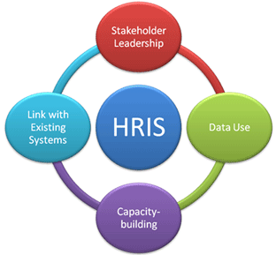
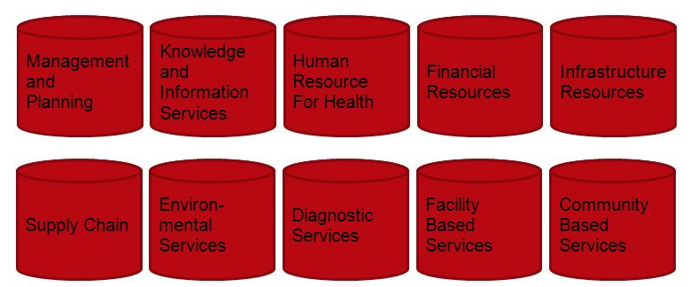
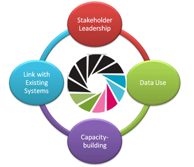

# Introduction to HRIS

## 1. What is a Human Resources Information System?

A human resources information system (HRIS) is used to collect, manage and analyze data about the people in the workforce.

An HRIS can be used to track information such as:

- employment, salary, and education history
- open positions and job applicants
- license and registration information.

[audio Slide\_1\_final.mp3, not published] Listen to the introduction or access the transcript in the box to the right.

## 2. Routine HRIS

A routine HRIS is one that is designed to be used on a daily basis, which:

- increases the value, quality, and ownership of data
- better answers HR policy and management questions
- ensures high quality data
- turns data into information

[audio Slide\_2\_final.mp3, not published] Listen to the introduction or access the transcript in the box to the right.

## 3. High Quality Health Worker Data

Quality human resources for health (HRH) data can be used for:

- education and training—making sound decisions about education and training priorities, policies, etc.
- registration—ensuring a qualified supply of health workers
- deployment—meeting health system needs
- management—tracking movement of personnel
- planning

[audio Slide\_3\_final.mp3, not published] Listen to the introduction or access the transcript in the box to the right.

## 4. Strategy for Routine HRIS

A routine HRIS should:

- be part of broader health information systems strengthening
- emphasize capacity-building
  - adaptability in-country
  - money in the right place
- have maximum interoperability now and in the future
- ensure maximum usability
  - simple, familiar interface
  - clear online and paper documentation
  - disciplined usability testing

[audio Slide\_4\_final.mp3, not published] Listen to the introduction or access the transcript in the box to the right.

## 5. Ten Health Information System Domains from Health Metrics Network (HMN)

HRH is one of the ten domains of a national health information aystem.

An HRIS should be interoperable with other domains.

[audio Slide\_5\_final.mp3, not published] Listen to the introduction or access the transcript in the box to the right.

## 6. Examples of Open Source Routine HRIS

- OrangeHRM
- iHRIS (a product of the USAID-funded Capacity*Plus* project)

[audio Slide\_6\_final.mp3, not published] Listen to the introduction or access the transcript in the box to the right.

## 7. iHRIS as a Routine HRIS

 Capacity*Plus*’s routine HRIS software (iHRIS) characteristics:

- free/open source software
- adaptable to in-country needs
- international development and support community
- development for one country or application made available to all
- available in English, French, Italian, Portuguese, Swahili
- web-based
- maximum utility, access and compatibility
- familiar interface
- LAMP environment

[audio Slide\_7\_final.mp3, not published] Listen to the introduction or access the transcript in the box to the right.

## 8. The iHRIS Suite

- iHRIS Manage—human resources management system
- iHRIS Qualify—training, certification and licensure tracking database
- iHRIS Plan—workforce planning and modeling software

[audio Slide\_8\_final.mp3, not published] Listen to the introduction or access the transcript in the box to the right.

## 9. iHRIS Links

Mailing List
<http://lists.intrahealth.org/mailman/listinfo/ihris-announce>

Source Code Host
<http://launchpad.net/ihris-suite>

Wiki
[http://open.intrahealth.org](http://open.intrahealth.org/)

Blog
<http://capacityproject.org/hris/blog>

To-Do List
<http://open.intrahealth.org/wiki/iHRIS_Ideas_List>

[audio Slide\_9\_final.mp3, not published] Listen to the introduction or access the transcript in the box to the right.
