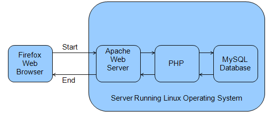

# Introduction to Key Systems Software

## 1. Intro to Key Systems Software

This module introduces:

- LAMP architecture components
- open source software
- Ubuntu

## 2. Operating Systems

An operating system (OS) is a software set that allows you to interact with your computer's hardware and enables communication between the different components of the system.

Windows XP, Windows 7, and MacOS are all different operating systems.

Linux is a free and open source alternative to these operating systems.

## 3. Open Source

Open source software is software where everyone can see the source code, which means:

- anyone can study, change, and improve the software
- it is developed in a public, collaborative manner
- there are no restrictions on who can get the software.

Learn More: <http://en.wikipedia.org/wiki/Open_Source_Definition>

## 4. Linux Operating System

Linux is a Unix-based operating system started by Linus Torvalds in 1991.

It excels in running web servers and databases.

Linux is reliable:

- as of June 2009, Linux powered 88.6% of the world's most powerful supercomputers
- as of December 2008, Linux powered five of the ten most reliable internet hosting companies, while Windows powered one
- over 60% of web servers run on Linux

## 5. Apache Web Server

A web server is the program that provides web pages to other computers.

Examples of web servers include Google and Yahoo.

The main languages for web pages are HTML and JavaScript.

Apache is the most popular web server—66% of the largest websites use Apache.

Apache is open source.

## 6. MySQL Database

A relational database is a program used to collect and analyze structured data:

- table: holds one type of structured data, such as a contact list
- column: the columns of the table hold the attributes of the structured data. For example the given name, surname, or date of birth of a contact person could be the columns in a contact list table
- row: each row of a table corresponds to a unique data record, so each individual would have a row that gives the contact person’s data for the attributes in the columns

The computer language SQL (Structure Query Language) is used to interact with a database.

MySQL is a popular open source database that uses SQL.

## 7. PHP

PHP is a popular language for making dynamic web servers.

You can use PHP to query a database and produce HTML or JavaScript for the web server.

## 8. LAMP Architecture

Server Running Linux Operating System

- Linux, Apache, MySQL, and PHP = LAMP Architecture
- A user interacts with the system through a web browser (Firefox or Internet Explorer)

## 9. Ubuntu

There are many different types of Linux. Ubuntu is a very popular and easy to install version: <http://www.ubuntu.com/>

## 10. Ubuntu

There are three ways to install Ubuntu:

- WUBI installer (easiest)
- using a VMWare virtual computer (moderate)
- natively to your computer (advanced)

In the next module, you will learn about iHRIS security, then you will choose one of the above ways to install iHRIS.
