# Installing Ubuntu Natively

## 1. Installing Ubuntu Natively

Ubuntu is an operating system designed to control your computer. It can run with or without Windows installed on the computer.

Install Ubuntu natively if:

- you want to take full advantage of all Ubuntu features
- you plan on running Ubuntu as a production web server or as your primary operating system
- you feel very comfortable using computers

## 2. Download Ubuntu

Download Ubuntu 10.10 (Latest Edition) 32-bit:

- <http://www.ubuntu.com/desktop/get-ubuntu/download>
- this is a Live CD that lets you either try or install Ubuntu

Save the file "ubuntu-10.10-desktop-i386.iso" to your desktop. It is a 700 mb download.

Burn the .iso file to a CD. See next two pages for options.

## 3. Burning the Ubuntu CD—Windows 7

Right click the file "ubuntu-10.10-desktop-i386.iso" on the desktop.

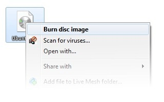

Select a disk burner (CD drive) and click "Burn".

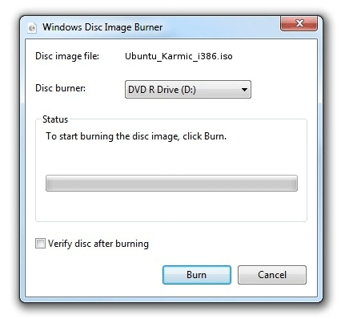

## 4. Burning the Ubuntu CD—Windows XP

Download and install InfraRecorder from:

- <http://infrarecorder.org/?page_id=5>
- choose: Installer (Windows 2000/XP/Vista/7, 3.53 MiB)

Insert a blank CD.

Select "Do nothing" or "Cancel" if an autorun dialog pops up.

Open InfraRecorder and click the "Write Image" button in the main screen.

Select the file "ubuntu-10.10-desktop-i386.iso" from the desktop.

Click "Open" and then "OK".

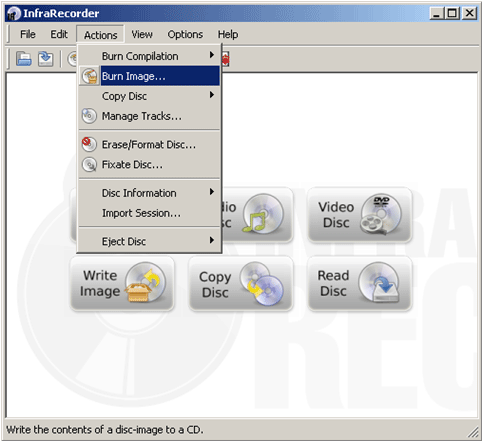

## 5. Running Windows and Ubuntu

Dual Booting

- dual booting is running two operating systems, Windows and Ubuntu, on the same computer.
- more details: <http://ubuntuguide.org/wiki/Ubuntu:Maverick#Dual-Booting_Windows_and_Ubuntu>

Resizing Partitions

- if you are running Windows, you will need to resize your Windows partition (C: drive) to make room to install Ubuntu
- you will need about 20GB of free space
- more details: <http://ubuntuguide.org/wiki/Multiple_OS_Installation#Changing_Windows_partition_sizes>

## 6. Booting from the Ubuntu CD

Insert the burned CD into your drive and reboot.

If your computer starts Windows, you may need change your BIOS settings to tell it to boot from the CD:

- the BIOS bootup menu is usually accessed during the first few seconds after powering on your computer
- the BIOS setup access key is often displayed on your screen (F2, Delete, or F10 key)
- newer computers allow a one-time choice to boot the CD
- if not, enter the BIOS setup menu and look for Bootup Device Priority (sometimes in the Advanced Setup menu)—make sure your CD/DVD drive is listed as the first boot device, before the hard drive

Once you have booted from the CD, installation is easy.

Video tutorial for dual-booting with Windows: <http://www.youtube.com/watch?v=JBfl3oViny8>

## 7. Choose Language

Select your language and click on the "Install Ubuntu" button to start the installation.

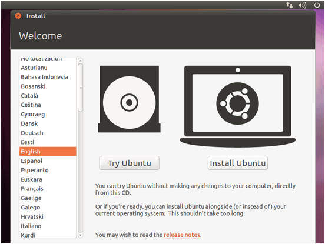

## 8. Check Requirements

On the next screen you will see requirements for the Ubuntu 10.10 installation.

Check "Download updates while installing" and "Install this third-party software" (this will install the software necessary to process Flash, MP3, and other media files).

Click "Forward".

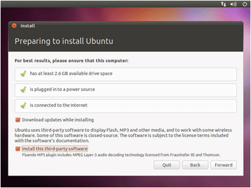

## 9. Allocate Drive Space

If you are not running Windows choose "Erase and use the entire disk".

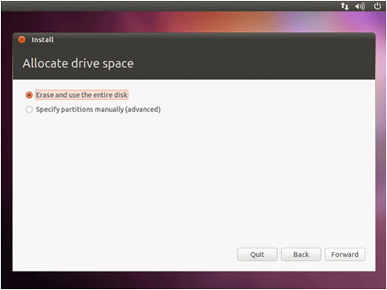

If you are running Windows, stop and follow the video tutorial mentioned earlier.

## 10. Allocate Drive Space

Choose which hard drive to use for the Ubuntu installation.

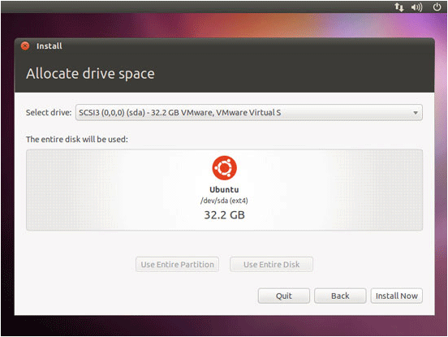

## 11. Select Time Zone

Choose your country.

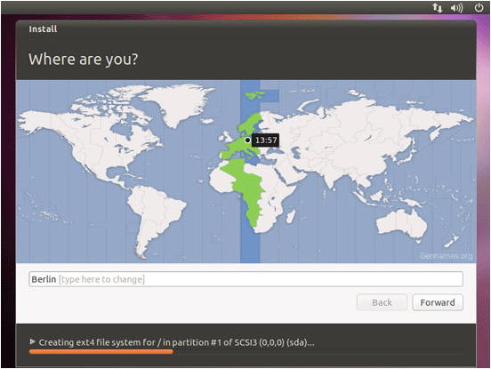

## 12. Select Keyboard

Choose your keyboard layout.

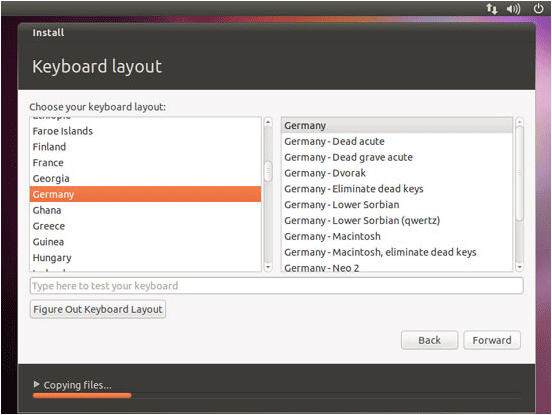

## 13. Create Account

Choose a username and password and a name for your computer. Once you have done this, Ubuntu will install.

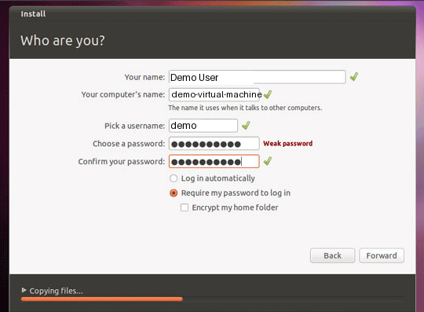

## 14. Boot Ubuntu

Once installation is complete, remove the CD and reboot your computer.

Boot to Ubuntu and login with your username and password.

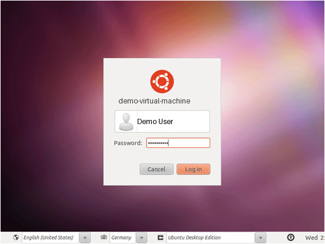
