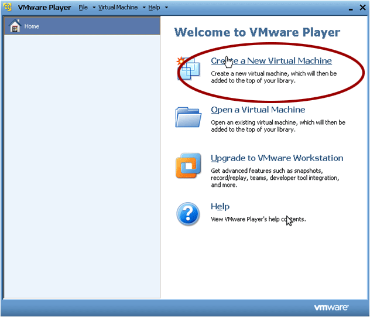
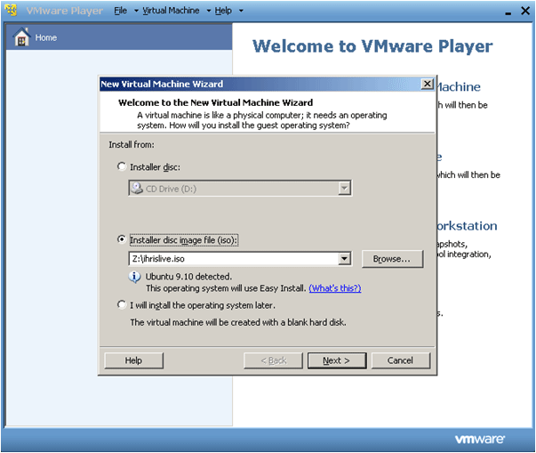
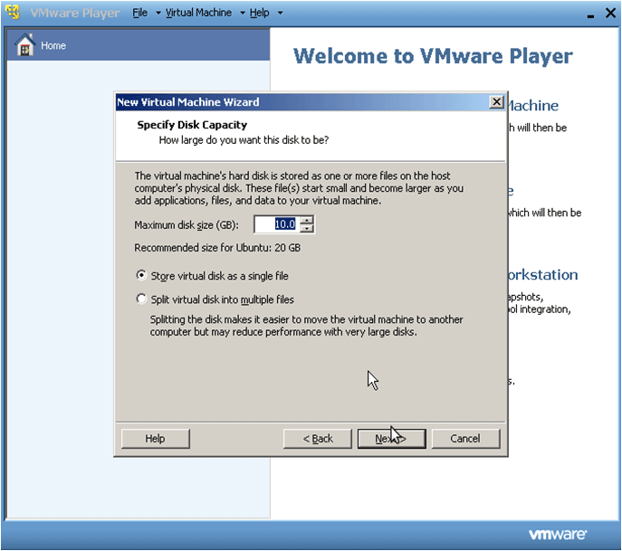
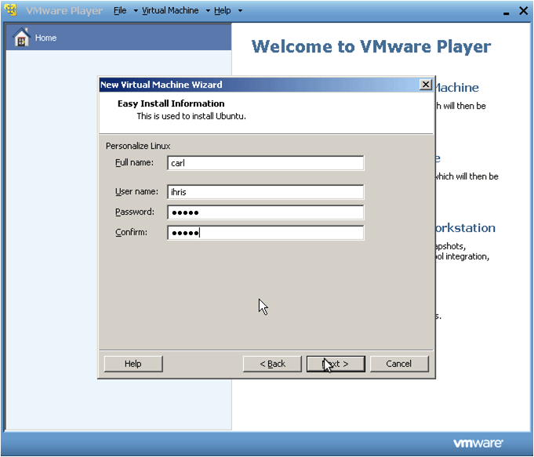
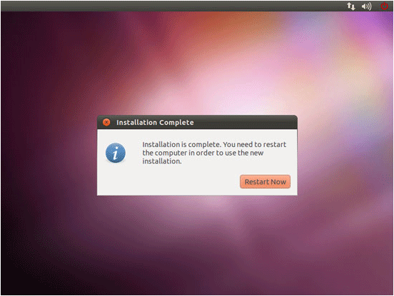

# Installing Ubuntu VMWare

## 1. Install Ubuntu on VMWare

Ubuntu is an operating system designed to control your computer.

Why you should install Ubuntu on VMWare:

- this installation method works if you already have Windows installed on your computer
- VMWare lets you create a virtual computer inside your Windows computer
- Ubuntu can be installed on the virtual computer
- Windows and Ubuntu can be used on one computer at the same time using this method
- users can test Ubuntu or different versions of Linux on one machine

## 2. Download Ubuntu

Download Ubuntu 10.10 (Latest Edition) 32-bit <http://www.ubuntu.com/desktop/get-ubuntu/download>

Save the file ubuntu-10.10-desktop-i386.iso to the Desktop. This is a 700 mb download.

## 3. Download VMWare

Register and download VMWare Player from: [http://www.vmware.com](http://www.vmware.com/)

Run installation .exe file.

Accept the Software License.

## 4. Create a Virtual Machine

Create a new virtual machine.

## 5. Create a Virutal Machine

Select "Install Source" to the Ubuntu Live CD .iso image, which you saved to the desktop.

## 6. Create a Virtual Machine

Select disk capacity to 10GB.

## 7. Create a Virtual Machine

Choose Ubuntu user name and password. Ubuntu will now be installed on your virtual machine.

## 8. Installation is Complete

Once installation is complete, reboot the virtual computer.

## 9. Booting to Ubuntu

Boot to Ubuntu and login with your username and password.

[image withheld: install\_ubuntu\_vmware6.gif shows a third party's name]

## 10. Ubuntu Post-Install

Install the VMWare tools.

Video tutorial:

[YouTube video J4FXEObkUG0](https://www.youtube.com/watch?v=J4FXEObkUG0)

## 11. Accessing Web Server from Windows

Set the Virtual Machine's Network to NAT.

Reboot Virtual Machine.

Open a Terminal (Applications &gt; Accessories &gt; Terminal) type:
 **ipconfig**

Look at **eth0** and the **inet addr** should be the **GUEST\_IP\_ADDRESS** address you'll use on windows  [http://GUEST\_IP\_ADDRESS/](http://guest_ip_address/)

## 12. Accessing Web Server from Local Network

Click on "NAT Settings for Ubuntu Virtual Machine".

You will see "Gateway IP Address"—this is your "HOST IP Address".

Click "Port Forwarding".

Click "Add".

Host Port: 80 (or **8080** if you use Skype).

Virtual Machine IP Address: GUEST\_IP\_ADDRESS

Computers on a network access iHRIS by: http://HOST\_IP\_ADDRESS :**8080** /

Learn more: <http://www.howtogeek.com/howto/vmware/allow-access-to-a-vmware-virtual-machinenat-from-another-computer/>
