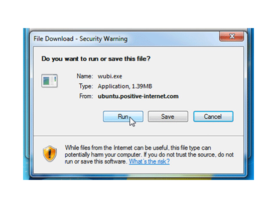
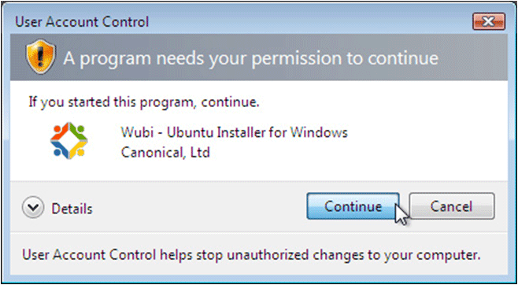
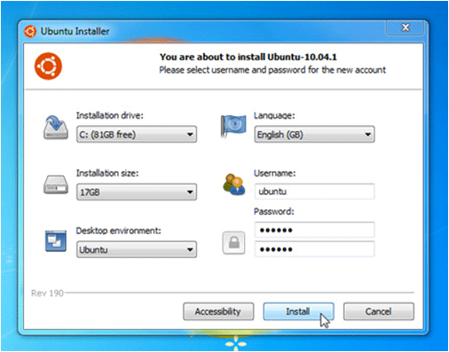
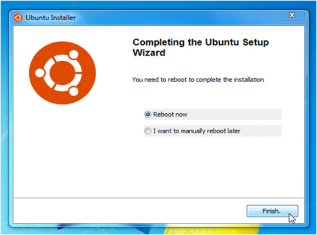
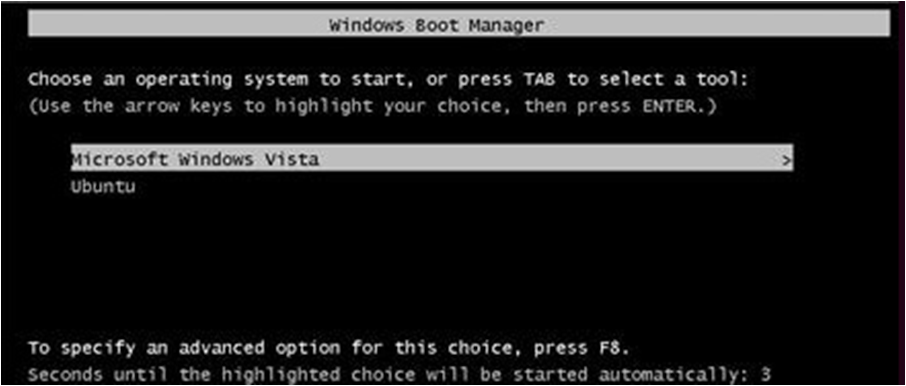

# Installing Ubuntu Windows Unbuntu Installer (WUBI)

## 1. Install Ubuntu with Windows Ubuntu Installer

Ubuntu is an operating system designed to control your computer.

Why you should install Ubuntu with WUBI:

- this installation method works if you already have Windows installed on your computer
- WUBI lets you install Ubuntu so that you can dual boot: when booting your computer you can choose either Windows or Ubuntu
- this installation method allows you to try out Ubuntu without making significant changes to your computer

## 2. Download WUBI

Download WUBI from: <http://www.ubuntu.com/desktop/get-ubuntu/windows-installer>

Click the orange button to start downloading.

Run the downloaded file.

## 3. Run WUBI

Windows may ask your permission to run WUBI; click "Continue".

## 4. Run WUBI

Choose a username and password.

Click "Install" (this is a 700 mb download).

## 5. Run WUBI

After downloading Ubuntu, WUBI will install.

To run Ubuntu, you need to restart your computer.

## 6. Reboot with Ubuntu

When you reboot your computer, it will ask you if you want to run Windows or Ubuntu.

Scroll down on the menu and choose Ubuntu.

