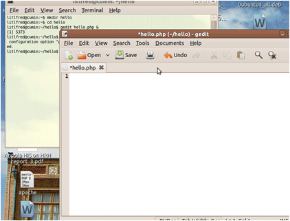
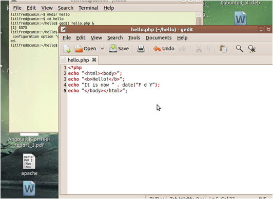

# Create PHP Program

## 1. Create a PHP Program

This module will outline the process of creating a simple PHP program including:

- installing the LAMP stack
- creating a basic hello.php PHP program in the home directory that will tell the time and say hello
- making this program available to the web server

## 2. Install the LAMP Stack

To install the base LAMP (Linux, Apache, MySQL, and PHP) stack on an Ubuntu/Linux computer, open a terminal to interact with your computer via the command-line.

Navigate to the "Applications" menu, go to "Accessories", then "Terminal" to access the command line.

## 3. Install the LAMP Stack

Once the terminal is open and there is a command prompt, type:
 **sudo apt-get update
 sudo apt-get install php5 mysql-server apache2**

This will update the list of available software and install the LAMP stack.

"sudo" means the programs will run with administrator (also called "root") privileges, so you will be prompted for your password on the first command. This password is probably the password of your user account, the one you use to login with.

While you are installing mysql it may ask you to choose a password. You should be sure to remember this for later when you need to create a database.

## 4. Create a Directory

In the terminal, make a change to the home directory with the command:
 **cd ~/**

Make a new directory there called "hello" with either one of the following commands:
 **mkdir hello**
or
 **mkdir ~/hello**

Go into the new directory with either one of the following commands:
 **cd hello**
or
 **cd ~/hello**

## 5. Create hello.php

Now create and edit a new file "greetings.php" in the hello directory.

In the command line type using either one of the following commands:
 **gedit ~/hello/greetings.php &**
or
 **cd ~/hello && gedit greetings.php &**

"gedit" is the name of the editor.

## 6. Say Hello in PHP

In the editor, type the following code including the spaces and punctuation:
 **&lt;?php
 echo "&lt;html&gt;&lt;body&gt;";
 echo "&lt;b&gt;Hello!&lt;/b&gt;";
 echo "It is now " . date("F d Y");
 echo "&lt;/body&gt;&lt;/html&gt;";**

Save it.

To see this file on the command line type:
 **ls -l ~/hello**

## 7. Make hello.php Available

"hello.php" is in the hello sub-directory of the home directory. However, web pages and php code live in the directory "/var/www". You will need administrator access to change it.

To link the hello directory so that it also is under "/var/www" type the command:
 **sudo ln -s ~/hello /var/www**

To see the hello.php file type either one of these commands:
 **ls -l ~/hello**
or
 **ls -l /var/www/hello**

## 8. Run the PHP Program

The PHP program runs whenever it is accessed by the Apache web server.

Your computer is named "localhost".

Open a web browser.

Because the greetings.php file is linked under "/var/www/hello/greetings.php", run the program by typing the following into the URL line of your web browser:
 [**http://localhost/hello/greetings.php**](http://localhost/hello/greetings.php)
