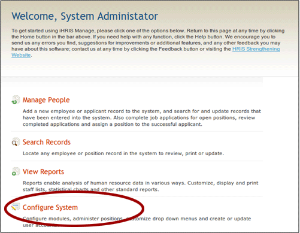
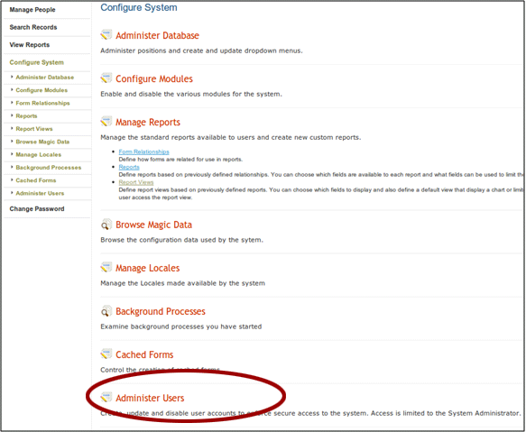
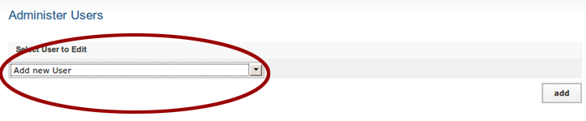
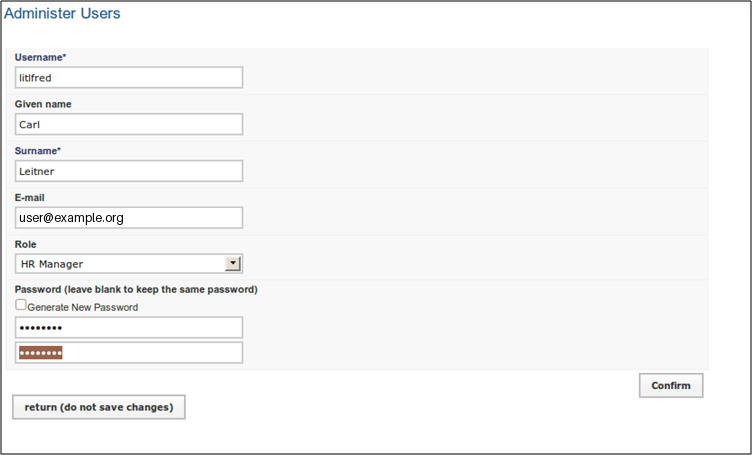
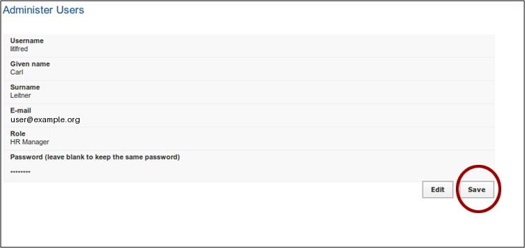

# User Roles and Adding New Users

## 1. iHRIS Users and Roles

This module covers:

- iHRIS users' roles and tasks
- how to add a new user to the system.

## 2. iHRIS Users and Roles

Each user of the iHRIS system is assigned a role.

Roles for iHRIS Manage:

- Administrator
- Executive Manager
- HR Manager
- HR Staff
- Training Manager

Roles for iHRIS Qualify:

- Administrator
- Data Operations Manager
- Decision-Maker
- Records Office
- Registration Supervisor

## 3. Roles and Tasks

Each role is defined by a collection of tasks that they can perform in the system.

These tasks can be modified.

Example tasks for an HR Manager:

- create and edit Report Views
- edit all database Lists
- edit all of a person's details
- change own password

Example tasks for HR Staff:

- view any Report Views
- edit the Facility List
- edit some of a person's details
- change own password

## 4. List of All Tasks by Role

A list of default tasks assigned to roles is at: <http://open.intrahealth.org/mediawiki/IHRIS_Role_List>

## 5. Adding a New User

You must be able to login as system administrator to add users:

- username: i2ce\_admin
- password: the mysql password you set on install

From the welcome page, click "Configure System".

## 6. Administer Users

Click "Administer Users".

## 7. Add New User

Select "Add New User" from the dropdown list.

Click "Add".

## 8. Enter User Details

Enter user details and select role.

Click "Confirm" to validate the details.

## 9. Create User

Create the user by clicking "Save".

