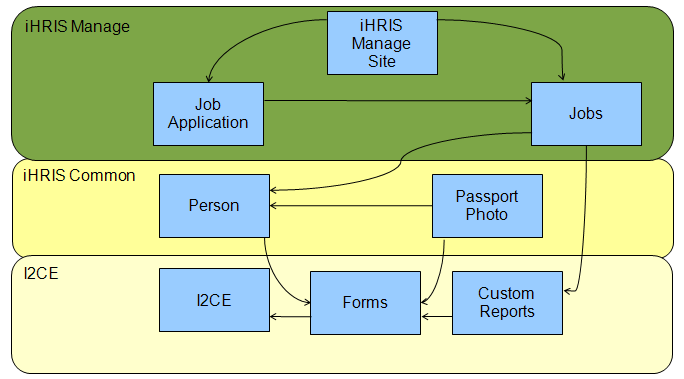
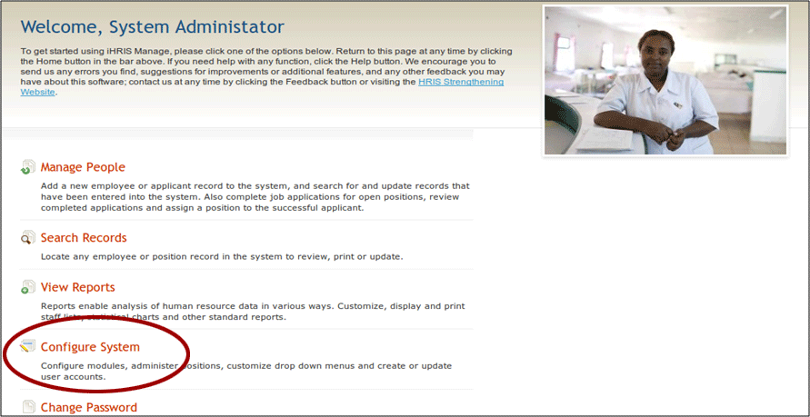
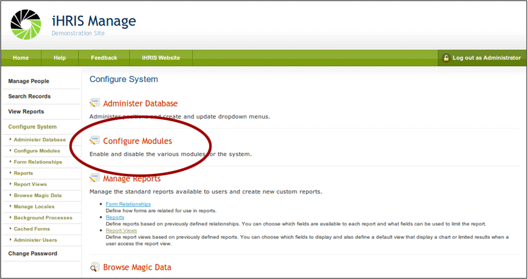
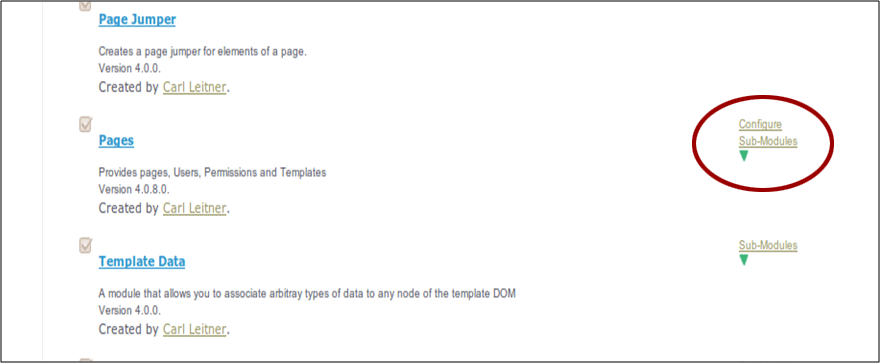
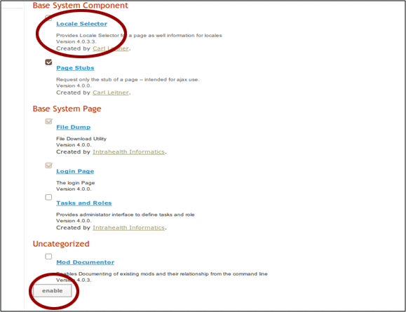
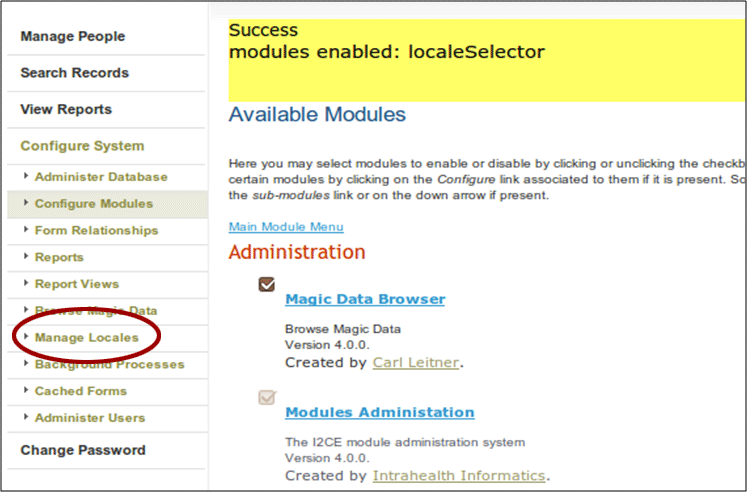
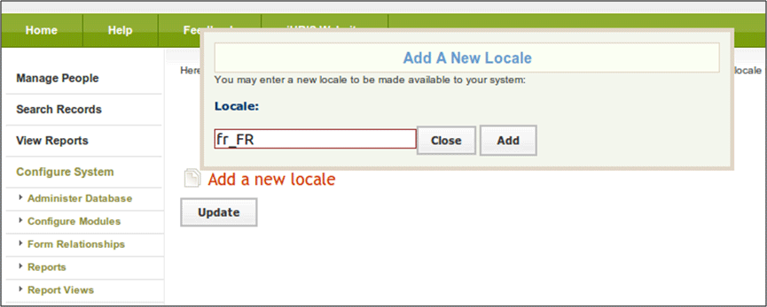
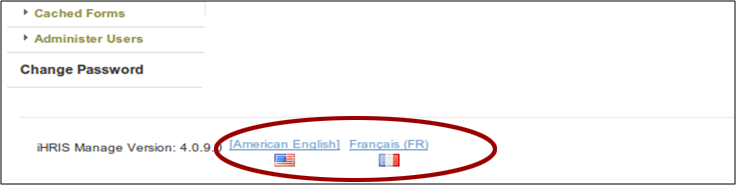

# iHRIS Modules

## 1. iHRIS Modules

This module covers:

- iHRIS modules
- module dependencies
- how to enable and configure modules

## 2. iHRIS Modules

The iHRIS suite of software is built from a series of modules.

Each module provides a specific functionality to the iHRIS system.

A module is defined in XML by its configuration file.

A module is a collection of:

- code: such as JavaScript, PHP, SQL
- web content: such as images or .html files
- configuration data: defined in its configuration file

## 3. Example Modules

Forms: handles the logic of collecting, storing, displaying, and editing structured data within the system

Person: defines the person form containing the information collected about a person such as the given name, surname, and date of birth

Custom Reports: allows the creation of reports based on the data forms in the system

Custom Reports - PDF: enables the creation of PDF versions of the Custom Reports

Intrahealth Informatics Core Engine (I2CE): main module of the system on which all modules are built

iHRIS Manage Blank Site: each iHRIS Site is its own module—such as the blank site on the iHRIS install

## 4. Modules and Dependencies

All modules depend on each other.

## 5. Enabling Modules

Module dependencies are defined by the module's configuration .xml file. Required modules cannot be disabled.

Some modules are optional and can be enabled two different ways:

- editing the site's modules configuration file to enable
- using the Module Configuration Web Interface

## 6. iHRIS and Translations

The iHRIS software has been translated into:

- Swahili
- French
- Italian
- Portugese
- Estonian

iHRIS handles translations of the software through the concept of "Locales".

## 7. Locales

A Locale is a pair of terms made of language and country.

Locales are labelled in the form xx\_YY:

- xx is a two letter language code
- YY is a two letter country code

Examples:

- en\_US is English in the United States
- en\_GB is English in Great Brittan
- fr\_FR is French in France

## 8. Enable Optional Modules

The following instructions illustrate how to enable optional modules using the example of the "Locale Selector" module.

Login as system administrator:

- username: i2ce\_admin
- password: the mysql password you set on install

## 9. Configure System

From the welcome page, select "Configure System".

## 10. Configure Modules

Click "Configure Modules".

## 11. Select Submodules of Pages

The Locale Selector is a submodule of the "Pages" module.

Scroll down until you see the "Pages" sub-modules.

## 12. Enable the Module

Check the "Locale Selector" module.

Click "Enable".

## 13. Manage Locales

The "Manage Locales" functionality is now enabled.

## 14. Add a New Locale

The System Administrator can make different Locales available to the end user.

## 15. Select Language

Now users can select a preferred language at the bottom of any page.

