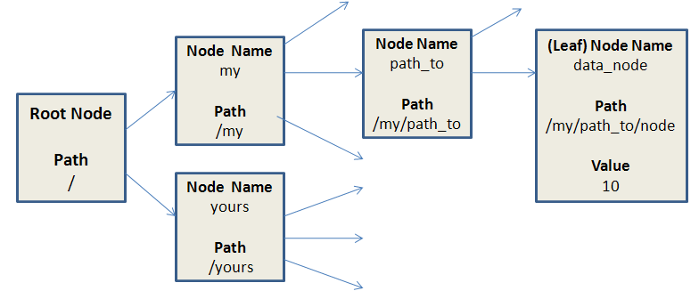
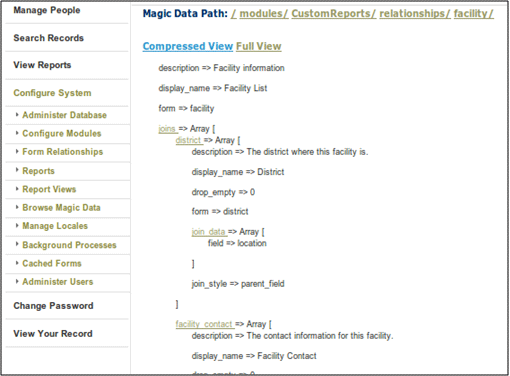

# Magic Data

## 1. I2CE Framework and Magic Data

I2CE stands for **I**ntraHealth **I**nformatics **C**ore **E**ngine.

I2CE is a framework used by iHRIS to create webpages, store data in the database, build custom reports, etc.

The framework is modular and I2CE and iHRIS are made up of many different modules.

These modules interpret and modify configuration data to determine what to do.

This configuration data is called **magic data**.

## 2. I2CE Framework

I2CE: IntraHealth Informatics Core Engine

This is the base web framework on which iHRIS Manage and iHRIS Qualify are built and includes:

- module structure
- magic data
- http requests
- pages and the wrangler
- templates

## 3. Modules

Modules:

- are the basic functional unit for the I2CE Framework
- are defined by configuration .xml file
- contain a combination of CSS, HTML, JavaScript, PHP, SQL, graphic files, etc.
- can define configuration data (magic data)
- have versions and can require or conflict with other modules
- can optionally enable other modules

## 4. Module Configuration File

Configuration File Structure

- determined by two files:
  - I2CE/lib/I2CE\_Configuration.dtd
  - I2CE/tools/check\_validity.php
- the structure requires Version, Name and DisplayName in the metadata sections
- it can optionally include:
  - dependent modules
  - search paths for different file types (SQL, images, HTML templates)
  - configuration/magic data

## 5. Module Classes

Modules can also be associated with a subclass of I2CE\_Module:

- allows for adding new fuzzy methods to a class—fuzzy methods are the means for I2CE and iHRIS to dynamically add new methods to PHP classes
- allows for hooks into various parts of the PHP—code hooks are used to dynamically change how data is processed
- handles the updating process as the module's code changes

## 6. Magic Data

Tree structure for dynamic definiton of iHRIS software.

Nodes are specified by a path:
 **/my/path\_to/node**

Leaf nodes/end nodes of the tree store data values, for example 10.

## 7. Magic Data

Tree structure for dynamic definiton of iHRIS software:

- Enabled Modules
- Pages
- Forms
- Reports

Defined in configuration xml files

Stored in the database table config\_alt

Cached in APC or memcached for speed

## 8. Defining Magic Data Example

Example from background process module:
 &lt;configurationGroup name='tasks' path='/I2CE/tasks/task\_description'&gt;
 &lt;configuration name='can\_view\_background\_processes' locale='en\_US'&gt;
 &lt;version&gt;3.2.2&lt;/version&gt;
 &lt;value&gt;Can view background processes&lt;/value&gt;
 &lt;/configuration&gt;
 &lt;/configurationGroup&gt;

The magic data value for this module is:
 /I2CE/tasks/task\_description/can\_view\_background\_processes

## 9. Defining Magic Data Example

Example from background process module:
 &lt;configurationGroup name='tasks' path='/I2CE/tasks/task\_description'&gt;
 &lt;configuration name='can\_view\_background\_processes' locale='en\_US'&gt;
 &lt;version&gt;3.2.2&lt;/version&gt;
 &lt;value&gt;Can view background processes&lt;/value&gt;
 &lt;/configuration&gt;
 &lt;/configurationGroup&gt;

Sets magic data value at:
 /I2CE/tasks/task\_description/can\_view\_background\_processes
To:
 Can view background process

## 10. Defining Magic Data Example

Example from background process module:
 &lt;configurationGroup name='tasks' path='/I2CE/tasks/task\_description'&gt;
 &lt;configuration name='can\_view\_background\_processes' locale='en\_US'&gt;
 &lt;version&gt;3.2.2&lt;/version&gt;
 &lt;value&gt;Can view background processes&lt;/value&gt;
 &lt;/configuration&gt;
 &lt;/configurationGroup&gt;

Sets magic data value at:
 /I2CE/tasks/task\_description/can\_view\_background\_processes
To:
 Can be translated

## 11. Magic Data Browser

The Magic Data Browser is an optional module that lets you view and edit magic data.

Caution: Modifying magic data changes how the site is defined, and there are no safety checks in place. Incorrect modifications can very easily break the site.

