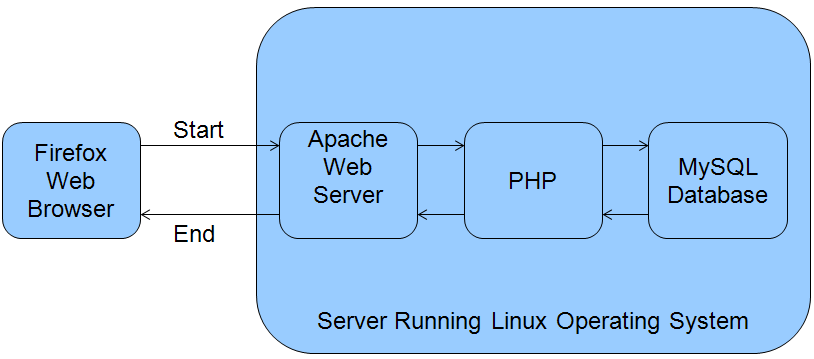

# Handling Pages

## 1. The I2CE Framework and the Pages module

I2CE is the web framework on which iHRIS Manage and iHRIS Qualify are built.

I2CE is a modular framework and one of these modules is **Pages.**

The **Pages** module:

- receives most requests from the web browser
- performs user authentication
- determes the apropriate page to be run
- sends the requested output back to the web browser

## 2. Web Server and PHP Basics

A web browser requests a page from an internet server by http (hypertext transfer protocol).

The address that you are connecting to is called a URL (uniform resource locator):

- <http://open.intrahealth.org>
- <http://hris.capacityproject.org/iHRIS/Manage/index.php>

The Apache web server receives the http request and processes the URL to determine what to send back to the web browser.

Apache transfers requests for files ending in .php for handling by a PHP interpreter.

## 3. PHP Interpreter

The PHP interpreter then decides what to do with the http request.

It may connect with the MySQL database to get the needed data.

Any output produced is sent back to the web server to be passed along to the web browser.

## 4. HTTP Requests in iHRIS

HTTP requests are handled by index.php, which ensures that there is a connection to the database.

If the system is not up-to-date, it goes to the Updater to make sure:

- the system is initialized
- there have been no changes to an enabled module's configuration file
- there have been no change to an enabled module's class file

It checks to see if the request is for a static file, and if so sends the file to the user and exits.

Otherwise it passes off control to Wrangler.

## 5. Wrangling Pages

The Wrangler determines which web page is run based on the requested URL.

Rules for turning the URL **http://localhost/ihris-manage/A/B/C** into a web page:

- check if A is registered as a "top-level" page under the magic data node /I2CE/page/A - If so, load and run that page, then quit.
- check if B is registered as a page for the module A under the magic data node /modules/A/page/B—If so, load and run that page, then quit.
- check for the default page (usually "home") for the module A. If it exists, run that page and quit.
- if there is no default page, then the process fails out.

Any unused portion of URL is passed as the "request\_remainder" to the page's constructor. In the above examples, this is what is passed as the request remainder:

- B/C
- C
- B/C

## 6. Pages

Pages are used to handle user interaction.

All pages are a subclass of the I2CE\_Page which:

- transforms the GET and POST variables into nested arrays
- loads main HTML template for the page
- defines web interaction by "action()"
- defines CLI interaction by "actionCommandLine()"
- shows processing page by "display()"

## 7. Register a New Page

A new page and its class must be registered in magic data.

Example from the list module:
 &lt;configurationGroup name="pages" path="/I2CE/page"&gt;
 &lt;configurationGroup name="lists"&gt;
 &lt;configuration name="class" &gt;
 &lt;value&gt;I2CE\_PageFormLists&lt;/value&gt;
 &lt;/configuration&gt;
 ....
 &lt;configurationGroup&gt;
 &lt;configurationGroup&gt;

Create a top-level page called "lists", which is handled by class "I2CE\_PageFormLists".

## 8. Page Permission Restriction

Access is restricted by tasks and roles set in the page's "args", or arguments, which are passed to the constructor.

Example from lists page in list module:
 &lt;configurationGroup name="lists"&gt;
 ....
 &lt;configurationGroup name='args'&gt;
 &lt;configuration name="tasks" values="single"&gt;
 &lt;value&gt;can\_edit\_database\_lists&lt;/value&gt;
 &lt;/configuration&gt;
 &lt;configurationGroup&gt;
 ....
 &lt;configurationGroup&gt;

A user's role has to have task "can\_edit\_database\_lists" to access the page.

## 9. Page Styles

A page style is a collection of characteristics shared by many pages: default html files, access control, etc.

It is passed in an args array to the page's constructor.

Example from lists page in list module:
 &lt;configurationGroup name="lists"&gt;
 ....
 &lt;configuration name="style" values="single"&gt;
 &lt;value&gt;main&lt;/value&gt;
 &lt;/configuration&gt;
 ....
 &lt;configurationGroup&gt;

Sets the lists page to the "main" style.

## 10. HTML Templates

An HTML template is a small bit of HTML that defines how one part of the web page is displayed.

A page loads various HTML template files as needed via I2CE\_Template class.

I2CE\_Template is a helper class for the Document Object Model (DOM)

Data can be associated to nodes in the DOM.

Special tags and attributes are processed:
 &lt;span type='form' name='person:surname' /&gt;
 &lt;span type='form' name='person:surname' ifset='true' /&gt;
 &lt;span type="module" name="accident" ifenabled="true" /&gt;
 &lt;span type="module" call="accident-&gt;showCurrentAccidents()"/&gt;
