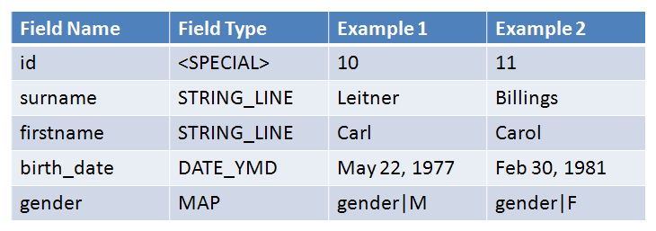
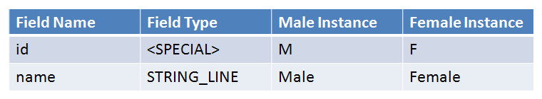

# Introduction to Forms

## 1. Introduction to Forms

A Form is the basic collection tool for data in I2CE—similar to a table schema.

"Form Instance" is like a row in a database table.

This module outlines:

- forms and fields
- parent and child forms
- form classes
- form factory
- form storage
- defining forms

[audio Slide\_01\_final.mp3, not published] Listen to the Forms audio or access the transcript in the box to the right.

## 2. Forms and Fields

Fields are like the columns of a database table.

Subclasses I2CE\_FormField controls how a form's data is edited and displayed depending on the fields type:

- Yes/No
- Integer
- String
- Multi-line string
- Dates
- Mapped Values

It also defines the storage and limits in the database.

[audio Slide\_02\_final.mp3, not published] Listen to the Forms audio or access the transcript in the box to the right.

## 3. Forms and Fields

Person form contains the fields:

This example has two instances: **person|10** and **person|11**

Notice any data quality issues?

[audio Slide\_03\_final.mp3, not published] Listen to the Forms audio or access the transcript in the box to the right.

## 4. Forms and Fields

Gender form contains the fields:

[audio Slide\_04\_final.mp3, not published] Listen to the Forms audio or access the transcript in the box to the right.

## 5. Parent And Child Forms

Each form has the special field "parent".

Any form can be related to any other form by the parent—child relationship.

Passport\_photo contains the fields:

[image withheld: into\_forms3.gif shows a photograph of a child]

[audio Slide\_05\_final.mp3, not published] Listen to the Forms audio or access the transcript in the box to the right.

## 6. Form Classes

Form classes: an extra layer of abstraction when defining forms:

- all forms classes have the sub-class: I2CE\_Form
- all fields are added to the form class not the form
- sometimes forms share the same fields
- some extra PHP code may need to be associated to a particular form class

Examples of form classes:

- I2CE\_SimpleList has the field name of type STRING\_LINE
- the forms *gender*, *marital\_status*, *facility\_type*, all use I2CE\_SimpleList
- I2CE\_SimpleList subclasses I2CE\_List which subclases I2CE\_Form

[audio Slide\_06\_final.mp3, not published] Listen to the Forms audio or access the transcript in the box to the right.

## 7. Form Factory

Form instances are created in the "form factory":
**$form\_factory = I2CE\_FormFactory::instance();**
**$genderObject = $form\_factory-&gt;createForm(”gender|M”);**
**$personObject = $form\_factory-&gt;createForm(”person|10”);**

Form factory looks up the form class associated to a form and adds fields:
**gender ? I2CE\_SimpleList**
**$formObj = new I2CE\_SimpleList();**
**$formObj-&gt;addField(”name”, new I2CE\_FormField\_STRING\_LINE());**
**$formObj-&gt;setId(”M”);**

You can populate the fields of the form object by looking it up in the database:
**$personObj-&gt;populate();**

[audio Slide\_07\_final.mp3, not published] Listen to the Forms audio or access the transcript in the box to the right.

## 8. Form Storage

The preceding example created a form via "createForm()" that created the structure to hold the data.

Filling up this structure with data read from the database is called "populating" the form.

[audio Slide\_08\_final.mp3, not published] Listen to the Forms audio or access the transcript in the box to the right.

## 9. Form Storage

There are many different ways of storing and reading data from the database. These are the "form storage mechanisms":

- entry: default form storage mechansim—logs changes made to the data
- magicdata: forms are stored in magic data—used for standard lists stored managed by central office
- flat: read forms in usual database table style such as the cached hippo\_XXX tables
- multi-flat: reads forms as cached from multiple hippo\_XXX tables stored across multiple databases—aggregation of decentralized data

[audio Slide\_09\_final.mp3, not published] Listen to the Forms audio or access the transcript in the box to the right.

## 10. Defining Forms

Defining a Simple List using a gender form as an example:

- values of this form populate any dropdown menus that map to the gender field (the gender field in the person form)
- "gender" is how to refer to the form when programming; the form will also need a human readable name
- the list is a standard list that should be shared across all sites (installations) so it should be saved in magic data

[audio Slide\_10\_final.mp3, not published] Listen to the Forms audio or access the transcript in the box to the right.

## 11. Defining Forms

Defining a Simple List example code:
&lt;configurationGroup name="gender\_form" path=**'/modules/forms/forms/gender'**&gt;
&lt;configuration name="class" &gt;
&lt;value&gt;I2CE\_SimpleList&lt;/value&gt;
&lt;/configuration&gt;
&lt;configuration name="display" locale="en\_US"&gt;
&lt;value&gt;Gender&lt;/value&gt;
&lt;/configuration&gt;
&lt;configuration name="storage"&gt;
&lt;value&gt;magicdata&lt;/value&gt;
&lt;/configuration&gt;
&lt;/configurationGroup&gt;

The form "gender" above is defined by a magic data node found in /modules/forms/forms.

[audio Slide\_11\_final.mp3, not published] Listen to the Forms audio or access the transcript in the box to the right.

## 12. Defining Forms

Defining a Simple List example code:
&lt;configurationGroup name="gender\_form" path='/modules/forms/forms/gender'&gt;
&lt;configuration name="class" &gt;
&lt;value&gt;**I2CE\_SimpleList**&lt;/value&gt;
&lt;/configuration&gt;
&lt;configuration name="display" locale="en\_US"&gt;
&lt;value&gt;Gender&lt;/value&gt;
&lt;/configuration&gt;
&lt;configuration name="storage"&gt;
&lt;value&gt;magicdata&lt;/value&gt;
&lt;/configuration&gt;
&lt;/configurationGroup&gt;

The "class" for the gender form above is "I2CE\_SimpleList".
/modules/forms/forms/gender/class = I2CE\_SimpleList

[audio Slide\_12\_final.mp3, not published] Listen to the Forms audio or access the transcript in the box to the right.

## 13. Defining Forms

Defining a Simple List example code:
&lt;configurationGroup name="gender\_form" path='/modules/forms/forms/gender'&gt;
&lt;configuration name="class" &gt;
&lt;value&gt;I2CE\_SimpleList&lt;/value&gt;
&lt;/configuration&gt;
&lt;configuration **name="display" locale="en\_US"**&gt;
&lt;value&gt;**Gender**&lt;/value&gt;
&lt;/configuration&gt;
&lt;configuration name="storage"&gt;
&lt;value&gt;magicdata&lt;/value&gt;
&lt;/configuration&gt;
&lt;/configurationGroup&gt;

The "display" name for this form is "Gender" and is translatable.

/modules/forms/forms/gender/display = Gender

[audio Slide\_13\_final.mp3, not published] Listen to the Forms audio or access the transcript in the box to the right.

## 14. Defining Forms

Defining a Simple List example code:
&lt;configurationGroup name="gender\_form" path='/modules/forms/forms/gender'&gt;
&lt;configuration name="class" &gt;
&lt;value&gt;I2CE\_SimpleList&lt;/value&gt;
&lt;/configuration&gt;
&lt;configuration name="display" locale="en\_US"&gt;
&lt;value&gt;Gender&lt;/value&gt;
&lt;/configuration&gt;
&lt;configuration name="**storage**"&gt;
&lt;value&gt;**magicdata**&lt;/value&gt;
&lt;/configuration&gt;
&lt;/configurationGroup&gt;

The data for this form is stored in magic data.

/modules/forms/forms/gender/storage= magicdata

[audio Slide\_14\_final.mp3, not published] Listen to the Forms audio or access the transcript in the box to the right.

## 15. Defining Forms

Defining a Simple List example code:

The gender form is stored in magic data.
&lt;configurationGroup name="gender\_form\_data" path="/**I2CE/formsData/forms/gender**"&gt;
&lt;configurationGroup name="F"&gt;
&lt;configuration name="last\_modified"&gt;
&lt;value&gt;2009-04-27 1:23:45&lt;/value&gt;
&lt;/configuration&gt;
&lt;configuration name="fields" value="many" type="delimited" locale="en\_US"&gt;
&lt;value&gt;name:Female&lt;/value&gt;
&lt;/configuration&gt;
&lt;/configurationGroup&gt;
&lt;/configurationGroup&gt;

The magic data for defining the form gender lives at: /I2CE/formsData/forms/gender

[audio Slide\_15\_final.mp3, not published] Listen to the Forms audio or access the transcript in the box to the right.

## 16. Forms: Defining Forms

Defining a Simple List example code:
&lt;configurationGroup name="gender\_form\_data" path="/I2CE/formsData/forms/gender"&gt;
&lt;configurationGroup name="F"&gt;
&lt;configuration name="last\_modified"&gt;
&lt;value&gt;2009-04-27 1:23:45&lt;/value&gt;
&lt;/configuration&gt;
&lt;configuration name="fields" value="many" type="delimited" locale="en\_US"&gt;
&lt;value&gt;name:Female&lt;/value&gt;
&lt;/configuration&gt;
&lt;/configurationGroup&gt;
&lt;/configurationGroup&gt;

This code defines the gender form instance with id "F" (there should also be an "M").

The form id is "gender|F"

[audio Slide\_16\_final.mp3, not published] Listen to the Forms audio or access the transcript in the box to the right.

## 17. Defining Forms

Defining a Simple List example code:
&lt;configurationGroup name="gender\_form\_data" path="/I2CE/formsData/forms/gender"&gt;
&lt;configurationGroup name="F"&gt;
&lt;configuration name="**last\_modified**"&gt;
&lt;value&gt;**2009-04-27 1:23:45**&lt;/value&gt;
&lt;/configuration&gt;
&lt;configuration name="fields" value="many" type="delimited" locale="en\_US"&gt;
&lt;value&gt;name:Female&lt;/value&gt;
&lt;/configuration&gt;
&lt;/configurationGroup&gt;
&lt;/configurationGroup&gt;

Setting the 'last\_modified' time speeds up form caching.

/I2CE/formsData/forms/gender/F/last\_modified = 2009-04-27 1:23:45

[audio Slide\_17\_final.mp3, not published] Listen to the Forms audio or access the transcript in the box to the right.

## 18. Defining Forms

Defining a Simple List example code:
&lt;configurationGroup name="gender\_form\_data" path="/I2CE/formsData/forms/gender"&gt;
&lt;configurationGroup name="F"&gt;
&lt;configuration name="last\_modified"&gt;
&lt;value&gt;2009-04-27 1:23:45&lt;/value&gt;
&lt;/configuration&gt;
&lt;configuration **name="fields" value="many" type="delimited"** locale="en\_US"&gt;
&lt;value&gt;**name:Female**&lt;/value&gt;
&lt;/configuration&gt;
&lt;/configurationGroup&gt;
&lt;/configurationGroup&gt;

Set the values of each of the "fields".

"delimited" means that the values are key-value pairs.

/I2CE/formsData/forms/gender/F/fields/name = Female

[audio Slide\_18\_final.mp3, not published] Listen to the Forms audio or access the transcript in the box to the right.

## 19. Defining Form Classes

The Simple List
&lt;configurationGroup name="SimpleList" path=”//modules/forms/formClasses/SimpleList”&gt;
&lt;configuration name="extends"&gt;
&lt;value&gt;I2CE\_List&lt;/value&gt;
&lt;/configuration&gt;
....
&lt;/configurationGroup&gt;

The "I2CE\_SimpleList" form Class definition is stored under /modules/forms/formClasses

I2CE\_SimpeList extends I2CE\_List

No I2CE\_SimpleList.php file exists, so:
class I2CE\_SimpleList exends I2CE\_List {}

[audio Slide\_19\_final.mp3, not published] Listen to the Forms audio or access the transcript in the box to the right.

## 20. Defining Form Classes

The Simple List:
&lt;configurationGroup name="SimpleList" path=”/modules/forms/formClasses/I2CE\_SimpleList”&gt;
...
&lt;configurationGroup name="fields"&gt;
&lt;configurationGroup name="name"&gt;
&lt;configuration name="formfield"&gt;
&lt;value&gt;STRING\_LINE&lt;/value&gt;
&lt;/configuration&gt;
&lt;/configurationGroup&gt;

The magic data node fields store all field information in the I2CE\_SimpleList class.

Name is one of the fields.

The formfield type of name is STRING\_LINE

[audio Slide\_20\_final.mp3, not published] Listen to the Forms audio or access the transcript in the box to the right.

## 21. Defining Form Classes

The Simple List:
&lt;configurationGroup name="SimpleList" path=”/modules/forms/formClasses/I2CE\_SimpleList”&gt;
...
&lt;configurationGroup name="fields"&gt;
&lt;configurationGroup name="name"&gt;
....
&lt;configuration name="**headers**" type="**delimited**" locale="en\_US"&gt;
&lt;value&gt;**default:Name**&lt;/value&gt;
&lt;/configuration&gt;
&lt;/configurationGroup&gt;

A header is displayed to the left of the field.

You can define multiple headers for a field.

Name has default header "Name"

[audio Slide\_21\_final.mp3, not published] Listen to the Forms audio or access the transcript in the box to the right.

## 22. Defining Form Classes

The Simple List
&lt;configurationGroup name="SimpleList" path=”/modules/forms/formClasses/I2CE\_SimpleList”&gt;
...
&lt;configurationGroup name="fields"&gt;
&lt;configurationGroup name="name"&gt;
....
&lt;configuration **name="required" type="boolean"**&gt;
&lt;value&gt;**true**&lt;/value&gt;
&lt;/configuration&gt;
&lt;/configurationGroup&gt;

Setting the name field is required.

A "true" configuration value with Boolean type gets interpretted as 1 in magic data:

/modules/forms/formClasses/I2CE\_SimpleList/fields/name/required=1

[audio Slide\_22\_final.mp3, not published] Listen to the Forms audio or access the transcript in the box to the right.

## 23. Defining Form Classes

The Simple List
&lt;configurationGroup name="SimpleList" path=”/modules/forms/formClasses/I2CE\_SimpleList”&gt;
...
&lt;configurationGroup name="fields"&gt;
&lt;configurationGroup name="name"&gt;
....
&lt;configuration **name="unique" type="boolean"**&gt;
&lt;value&gt;**true**&lt;/value&gt;
&lt;/configuration&gt;
&lt;/configurationGroup&gt;

The name field has to be unique among all form instances for a given form.

If there is a mapped field, unique can apply only to form instances with a specific value for that field (this is done in geography).

[audio Slide\_23\_final.mp3, not published] Listen to the Forms audio or access the transcript in the box to the right.
