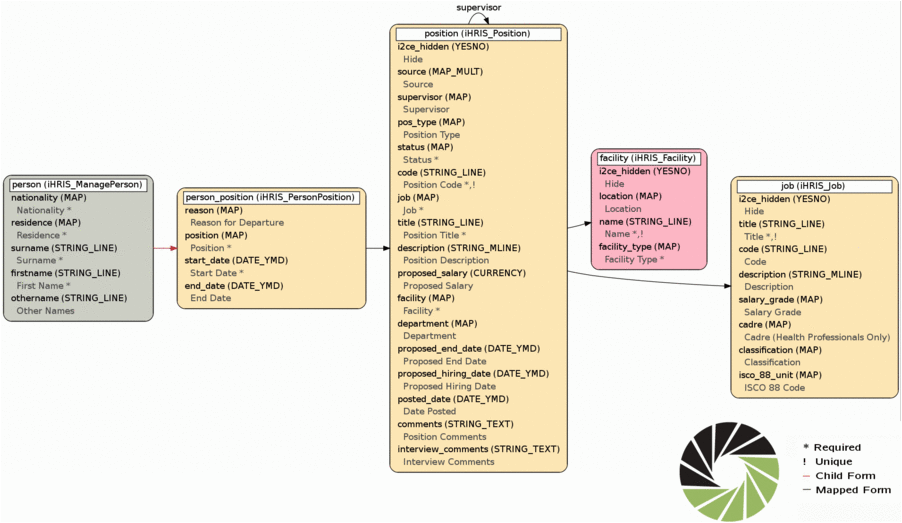
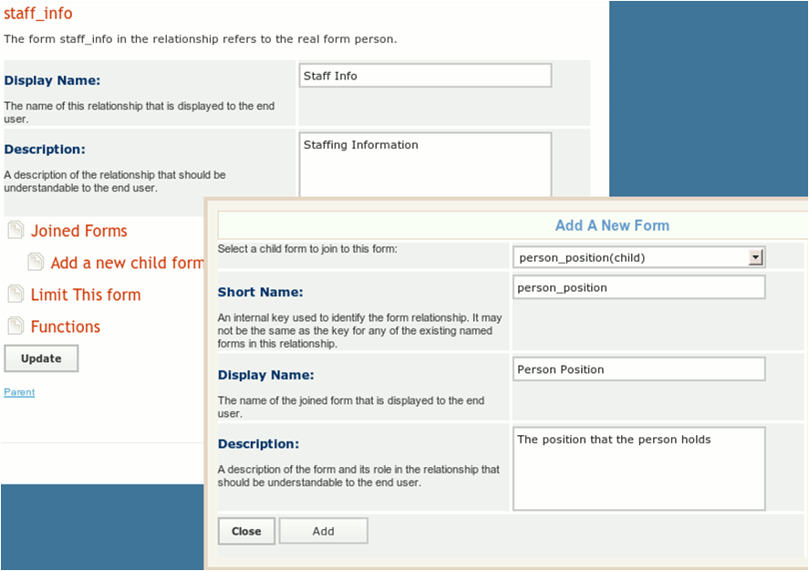
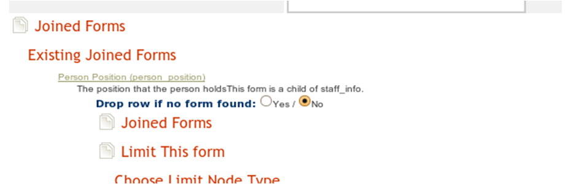
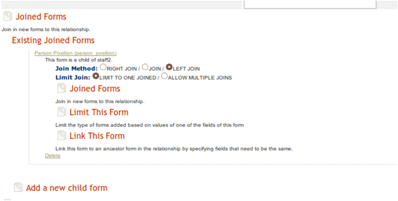
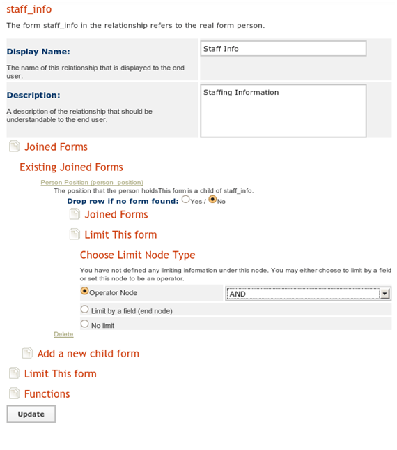
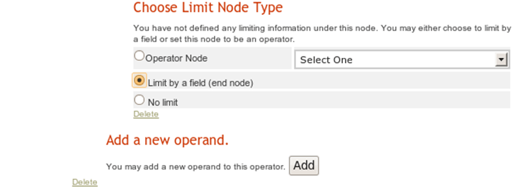
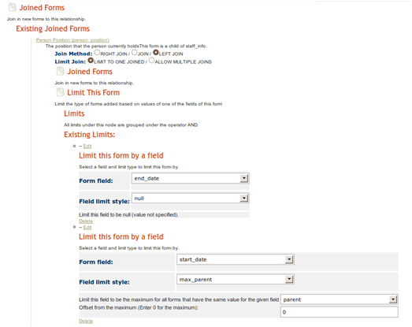
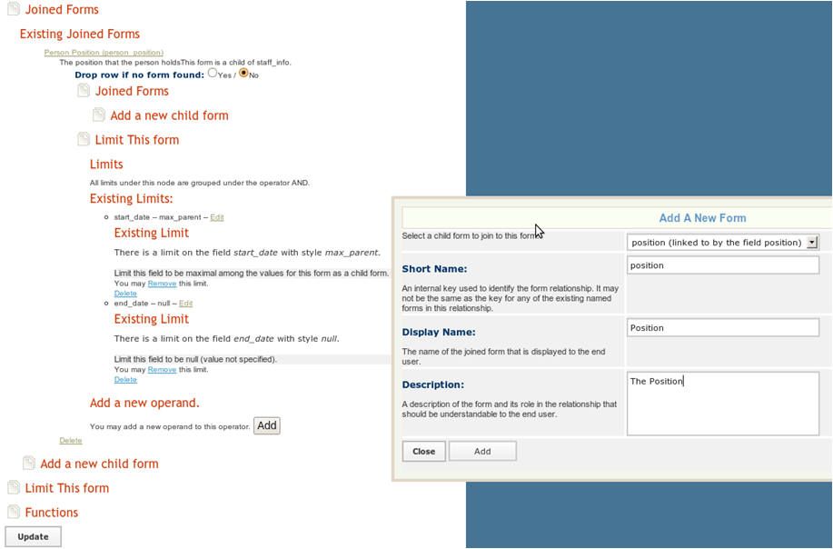

# Custom Reports

## 1. Custom Reports

iHRIS has a custom reporting system to develop new reports based on the data in the system.

There is a data map that shows how all the data is related in the system.

Building a custom report is a three part process:

- create directions to navigate the data map (form relationship)
- determine what data to use from the map (report)
- display the selected data (report view)

## 2. Custom Reports

To create a custom staff info report for iHRIS Manage:

- create a custom form relationship "staff\_info"
  - choose the forms and how they are related to each other
- create a custom report "staff\_report" based on the staff\_info relationship
  - choose the fields for the report from the relationship created above
  - choose which fields to limit by for all the report views created from this report
- create a custom report view for the staff report
  - various report views are intended for non-administrative users to view the data in the system

## 3. Custom Reports Example

Requirement: create a staff list with each person's cadre and facility.

Determine what data is needed and where it is stored.

Start with the form and field map.

**See a video demonstration of this example in the box on the right.**

## 4. Form Map

Taken from larger [form and field map](http://open.intrahealth.org/mediawiki/IHRIS_Manage_Form_Fields):

## 5. Form Relationships

To construct a form relationship, join forms by traversing the arrows of the form field map, both forward and backward.

There are two colors of arrows:

- Black arrows:
  - the source of an arrow, formA, is related to the target of the arrow form, formB, via a mapped field
  - if the arrow is not labeled, then the mapped field is also named formB, otherwise it is the label of the arrow
  - although formA maps to at most one instance of formB, there may be many instances of formA mapping to formB
  - to go backward on a black arrow, limit the joined form so that a unique form is chosen
- Red arrows:
  - the source of an arrow, formA, is the parent of the target of the arrow, formB
  - formA may have many instances of formB as a child form, but formB can only have one parent form
  - to go forward on a red arrow, limit the child form so that a unique child form is chosen

## 6. (untitled page)

To make a report for the requirement in the example, include the following forms:

- facility: to find name of the facility
- job: to find the cadres
- person: although not explicitly stated as a requirement, assume that the names of the staff will aid in organizing the report

## 7. Connecting Forms

The data map does not have arrows that directly connect the facility, job, and person forms.

The forms must be connected:

- from"person" to "person\_position"
- from "person\_position" to "position"
- from "position", "facility" and "job" can be connected

## 8. Connecting Forms

In the example, there is one red arrow connecting "person" and "person\_position," and the rest of the arrows are black.

## 9. Form Relationships

Once the forms and their connections are identified, you can build a form relationship called "staff\_info."

You will use the primary form to traverse the form map.

You can choose where to start mapping, but choosing different primary forms will produce a different data set.

## 10. Form Relationships

There are several ways to build the form relationship (always clarify which option a user intended):

- option a: select "person" as the primary form—reports based on the relationship "staff\_info" will contain everyone in the system whether or not they have a position
- option b: select "position" as the primary form—reports based on the relationship "staff\_info" will only contain the people in the system that have a position and positions that have no people assigned to them
- option c: select "person\_position" as the primary form—reports based on the relationship "staff\_info" will only have currently filled positions

## 11. Form Relationships

For this example, choose option a, create a report relationship called "staff\_info", and choose "person" as the primary form.

Select "Configure System" and then "Form Relationships".

Enter a display name and description and click "Update".

## 12. Form Relationships

## 13. Form Relationships

The "staff\_info" relationship is now ready for editing:

- join "person\_position" to "position“ by clicking "Joined Forms" then "Add a New Form"
- select "person\_position (child)" as the form to add
- set the "short name" to person\_position
- set a display name and description for this form

## 14. Form Relationships

## 15. Joined Forms

For iHRIS versions 4.0.8 or earlier, the screen should look like this:

## 16. Joined Forms

iHRIS version 4.0.9 introduced new functionality to the custom reporting system, so the screen should look like this:

Default options have the same effect in all versions.

## 17. Limiting Form Relationships

"person" to "person\_position" traverses a red arrow forward

Limit the forms as there may be many "person\_positions" associated with "person" in the example.

Limit "person\_position" so that:

- the "end\_date" is not null, to ensure the employee still holds this position
- the "start\_date" is maximum start\_date for all the person\_position forms whose parent form is a person we are working with

## 18. Limiting Form Relationships

To limit the relationship, click "Joined Forms".

Select the form you just added, "Person Position" (person\_position).

Choose "Limit This Form".

Since there are two limits to place on this form, set the "Operator Node" to "And."

## 19. Limiting Form Relationships

## 20. Limiting Form Relationships

Click "Update" and choose "Add A New Operand".

You will do this twice, once for the "start\_date" and once for the "end\_date".

Once the operands have been added, "Edit" each of them and "Limit By A Field".

Click "Update".

## 21. Limiting Form Relationships

For the "end\_date" field:

- set the limit style to be "null"
- this means the end date has not been set

For the "start\_date "field:

- make the limit style "max\_parent"
- make this field the maximum for all (person\_positoin) forms that have the same value for the field "parent"
- make the offset from the maximum "0"

## 22. Joining Forms

Join "position" to "person\_position" as a linked form:

- click "Joined Forms" and "Add A New Child Form" underneath "person\_position"
- do not specify limits here as you are traversing a black arrow in the correct direction

## 23. Joining Forms

## 24. Joining Forms

We will finish by joining "facility" form to the "position" form. You will also need to join the "job" form to the "position" form.

To do so, click "Joined Forms" and "Add A New Child Form" underneath "position".

Do not specify any limits here as you are traversing a black arrow in the correct direction.

## 25. Custom Reports Variations

Option A:

- The preceeding example limited the end\_date to not null to get current positions only. Without the limit, the results would include the last position the person held, regardless of whether they currently hold it or not.
- If a person was assigned to more than one position at a time with the same start\_date, then there will be a person\_position for each of the positions, so that when the person\_position form is joined it will choose one of person\_position forms arbitrarily. If you expect that people can have more than one position, then you should choose option B.
- If you selected "Drop row if no form found" under the person\_position form, then if a person did not have an associated person\_position form, they would be removed from the report. Selecting to do so would make this a "Current Staff Report", rather than a "Person Report”.

## 26. Custom Reports Variations

Option B: Position Report

- select "Configure System" and "Form Relationships"
- create a report relationship called staff\_info\_b and choose "position" as the primary form,
- enter a display name and description and click update
- edit the staff\_info\_b relationship:

- join "facility" to "position" by the mapped field "position" or join "job" to "position" by the mapped field "job"
- join "person\_position" to "position" via the "position" field
- this will traverse a black arrow backwards in the form field map, so add an "end\_date" of null limit to choose a unique "person\_position" form
- join "person" to "person\_position" as its parent form (this will traverse a red arrow backwards, so there is no ambiguity about the form joining)
- choosing "Drop Row If No Form Found" when joining the person\_position form produces only positions assigned to someone so that it becomes a filled positions report, and not a current positions report

## 27. Custom Reports Variations

Option C: Current Position Report

- select "Configure System" and "Form Relationships"
- create a report relationship called staff\_info\_c and choose "person\_position" as the primary form
- enter a display name and description and click "Update"
- edit the "staff\_info\_c" relationship:

- limit the "person\_position" form so that the "end\_date" is null to only show current positions
- join "person" as the parent form of "person\_position" (traversing a red arrow backward)
- join "position" to "person\_position" via the mapped field position (traversing a black arrow forward)
- join "job" and "facility" to the "position" form (traversing a black arrow forward)
- if you chose not to use the limit "end\_date" is null, the report would show the history of any position which has been filled

## 28. Custom Report

To create a custom report from the relationship “staff\_info”:

- go to "Configure System" and "Reports"
- create a new report called staff\_report based on the staff\_info relationship
- this will create a zebra\_staff\_report table in the database that is populated from the form cache tables:
  - hippo\_job
  - hippo\_person\_position
  - hippo\_position
  - hippo\_person
  - hippo\_facility

## 29. Report Views

A "report view" is a way of displaying some of the data/fields in a report:

- Paginated HTML Table
- Excel / CSV export
- XML Export
- Flash Charts

Limits in a report view are set in the report.

Each report view can have a default display.

## 30. Report Views

Go to "Configure System" and "Report Views" and choose to create a new report view based on "staff\_report".

Select the fields to display.

To choose limits for the report views and its fields:

- click "Reporting Forms" and "Fields" to enable or disable fields from the relationship to include in the report
- change the header text for the field and set the limits for the field
