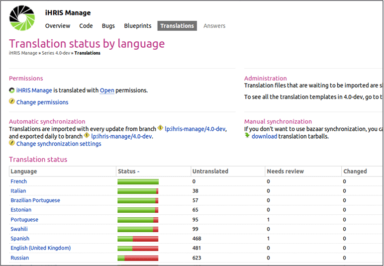
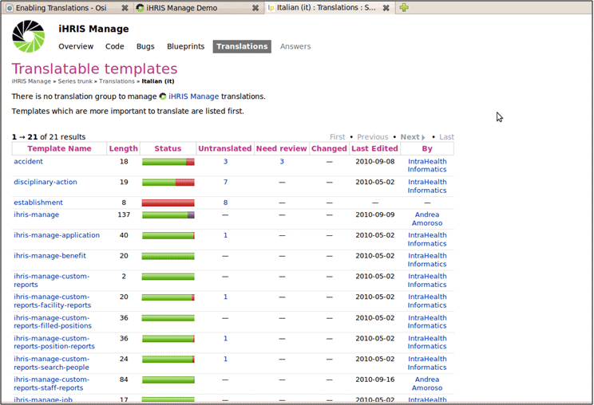
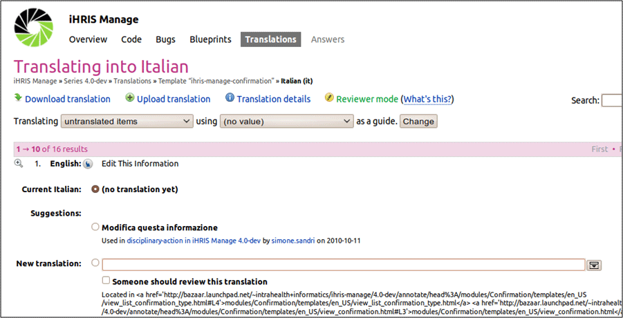

# Translating iHRIS

## 1. Translating iHRIS

The iHRIS software is written in English.

iHRIS supports translation into other languages.

Translations have been provided by community volunteers.

## 2. Translating iHRIS

The following languages are automatically available to the system:

- French (fr\_FR)
- Swahili (sw\_TZ)
- Portuguese (pt\_PT)
- Italian (it\_IT)
- Estonian (et\_ET)

The codes next to the languages above are "locales" that are used by iHRIS to keep track of translations in various languages.

## 3. Locales

A Locale is a pair: (language,country).

Locales are labeled in the form xx\_YY:

- xx is a two letter language code
- YY is a two letter country code (ISO 3166-1)

Examples:

- en\_US is English in the United States
- en\_GB is English in Great Brittan
- fr\_FR is French in France.

## 4. Translating into Other Languages

iHRIS uses Launchpad to manage all translations.

To manage translations, create an account on Launchpad: [https://www.launchpad.net](https://www.launchpad.net/)

Now you can add new translations by going to the following links:

- for both iHRIS Manage and Qualify
  - <https://translations.launchpad.net/ihris-common/4.0-dev>
  - <https://translations.launchpad.net/i2ce/4.0-dev>
- for iHRIS Manage
  - <https://translations.launchpad.net/ihris-manage/4.0-dev>
- for iHRIS Qualify
  - <https://translations.launchpad.net/ihris-qualify/4.0-dev>

## 5. Launchpad and Translations

List of available languages for translating iHRIS Manage:

## 6. Launchpad and Translations

Click a language get a list of modules in iHRIS Manage available for translation in that language.

## 7. Launchpad and Translations

Click one of the modules to get the English source text to translate.

## 8. Finding What To Translate

Determining in which module a specific phrase is located can be difficult. A list of all available English text can be found at: <http://open.intrahealth.org/mediawiki/Technical_Documentation#Translations>

[image not in the backup: slide0007\_image010.gif]

## 9. Launchpad and Translations

Every night, Launchpad updates all the translations available by saving to the approriate xx.po and xx\_YY.po files.

Example: it.po files contain the English text as "msgid" as well as its translation to Italian as "msgstr"

[image not in the backup: slide0008\_image012.gif]

## 10. Other Languages

Some languages have only been partially translated in Launchpad.

For other languages, iHRIS must process xx.po or xx\_YY.po files.

Example:
Process all "fr.po" files to produce French versions of all .html and .xml files:
 **cd /var/lib/iHRIS/lib/4.0.10/I2CE
 php ../I2CE/tools/translate\_templates.php --locales=fr
 cd ../ihris-common
 php ../I2CE/tools/translate\_templates.php --locales=fr
 cd ../ihris-manage
 php ../I2CE/tools/translate\_templates.php --locales=fr
 cd ../ihris-qualify
 php ../I2CE/tools/translate\_templates.php --locales=fr**

## 11. Marking English for Translation

HTML template and XML configuration files can be translated.

Magicdata in configuration files XML is marked as translatable by locale='en\_US'.

HTML template files are marked as translatable by putting them in a en\_US subdirectory.

Translations read from .po files which are downloaded automatically from Launchpad.
