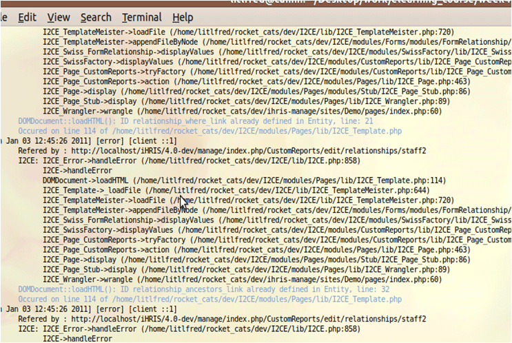
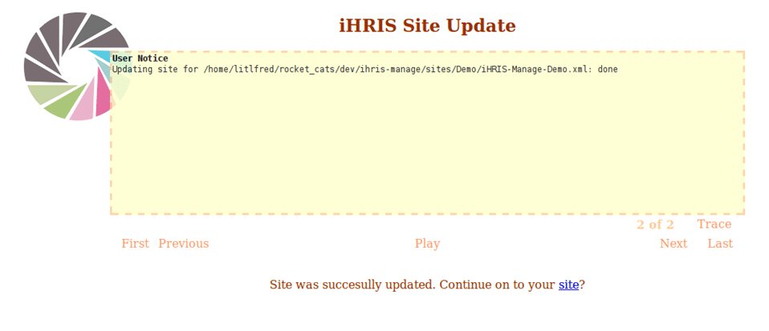
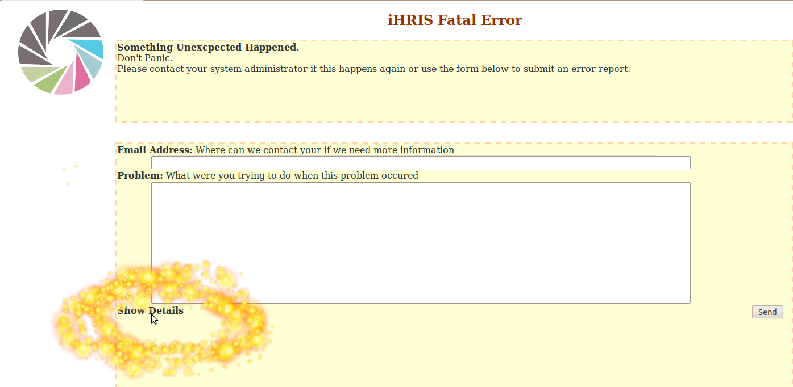

# Troubleshooting iHRIS

## 1. Troubleshooting iHRIS

As with all systems, iHRIS users may occasionaly have a problem with software bugs or misconfiguration issues.

The first steps in troubleshooting are:

- determine what went wrong
- see if you can reproduce the error

## 2. The Error Log

Apache and PHP write notices and error messages to the file: /var/log/apache2/error.log

iHRIS (via PHP) also writes specially formatted error messages to this file.

## 3. apache\_tail.php

apache\_tail.php is a special utility provided to make reading the error log easier.

If you followed the installation instructions, you should be able to use this utility by typing in:
 **/var/lib/iHRIS/lib/4.0.10/I2CE/tools/apache\_tail.php**

By default, apache\_tail will show the last few error messages.

To see only new messages, you can run:
 **/var/lib/iHRIS/lib/4.0.10/I2CE/tools/apache\_tail.php 0**

## 4. apache\_tail Output

Example output:

## 5. Messages in the Browser

Notices and error messages are sometimes displayed in the browser:

- on system installation or update
- on **Fatal Errors** in PHP, errors where the software cannot safely continue

## 6. Messages in the Browser

These messages are also sent to the error.log file so you can also view them with apache\_tail.php.

If your email is configured correctly, Fatal Errors allows you to email a message to the iHRIS developers about the problem.

## 7. Getting Help

For assistance in determining the meaning of error messages, visit the IRC channel to chat with an iHRIS developer:
 **irc://irc.oftc.net/#ihris**

The developer will ask for the output of apache\_tail.php to help identify the problem.

Use "pastebin" to copy the error message to the IRC channel—do not cut and paste.

## 8. Pastebin

Pastebin is a website designed to share code and error messages.

In your browser go to: [http://ihris.pastebin.com](http://ihris.pastebin.com/)

Cut and paste the error message into the text window of Pastebin and submit. Then copy the link into IRC.

[image withheld: troubleshooting3.gif shows a third party's name]

## 9. Calling apache\_tail Easily

For some tasks, such as creating a new module in iHRIS, you may need to use apache\_tail often.

Rather than typing the apache\_tail URL each time, create a link to it in /usr/local/bin with the code:
 **sudo ln -s /var/lib/iHRIS/lib/4.0.10/I2CE/tools/apache\_tail.php /usr/local/bin/apache\_tail**

Now you can run apache\_tail on the command line by simply typing:
 **apache\_tail**
