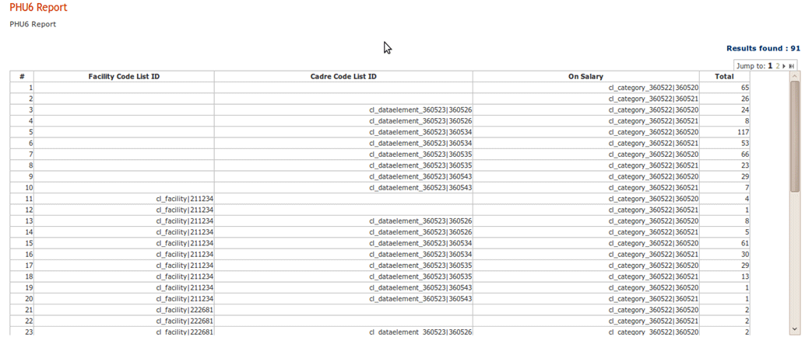
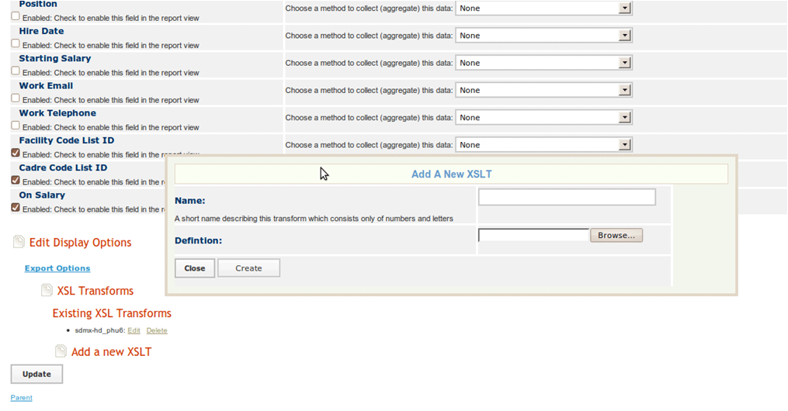
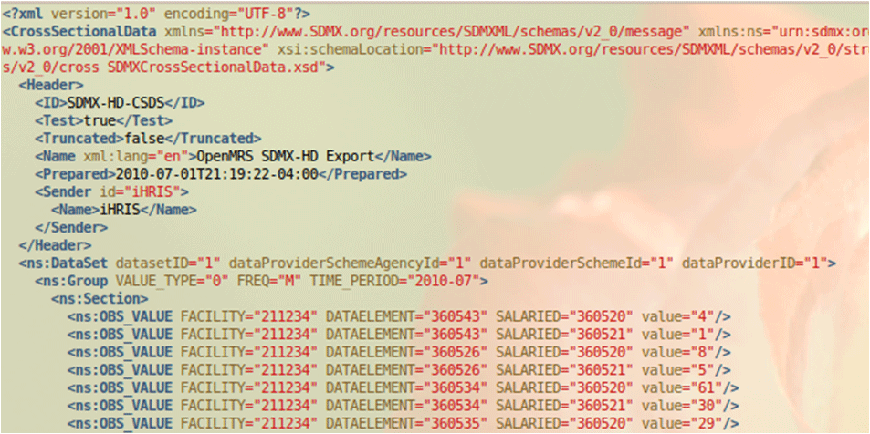

# Interoperability and SDMXHD

## 1. Interoperable Health Information Systems

There are many components of a health information system:

- human resource information system (such as iHRIS)
- health management information system (such as DHIS2)
- medical records systems (such as OpenMRS)

Here are two approaches to sharing data among systems:

- program interfaces between each indiviudal system
- provide a common data format that each system uses to share data

One common data format is the Statisitical Data and Metadata eXchange format (SDMX-HD).

## 2. SDMX-HD and HIS

SDMX-HD was developed by the World Health Organization (WHO) to facilitate the exchange of indicator definitions and data in aggregate data systems.

Various components of an HIS (health information system) can use SDMX-HD to exchange data.

SDMX-HD is supported by several open source and open standards programs including:

- iHRIS
- DHIS2 (district health information system)—<http://www.dhis2.org/>
- OpenMRS (an electronic medical records system)—<http://openmrs.org>
- IMR (WHO's indicator and measurement registry)—<http://www.who.int/gho/indicator_registry/en/>

## 3. iHRIS and SDMX-HD

iHRIS can import code lists from an SDMX-HD DSD file.

A code list is mapped to "SimpleList" using the SDMX-HD form storage mechanism:

&lt;configurationGroup name="cl\_facility" path=”/modules/forms/forms/cl\_facility”&gt;
&lt;displayName&gt;SDMX-HD Code List: cl\_facility&lt;/displayName&gt;
&lt;description&gt;The SDMX-HD Code List: Facility&lt;/description&gt;
&lt;configuration name="class" values="single"&gt;
&lt;value&gt;I2CE\_SimpleList&lt;/value&gt;
&lt;/configuration&gt;
&lt;configuration name="display" values="single" locale="en\_US"&gt;
&lt;value&gt;Facility&lt;/value&gt;
&lt;/configuration&gt;
&lt;configuration name="storage" values="single"&gt;
&lt;value&gt;SDMXHD&lt;/value&gt;
&lt;/configuration&gt;
&lt;configurationGroup name="storage\_options" path="storage\_options/SDMXHD"&gt;
&lt;configuration name="file" values="single"&gt;
&lt;value&gt;DSD\_2010\_05\_07.xml&lt;/value&gt;
&lt;/configuration&gt;
&lt;configuration name="CodeListID" values="single"&gt;
&lt;value&gt;CL\_FACILITY&lt;/value&gt;
&lt;/configuration&gt;
&lt;/configurationGroup&gt;
&lt;/configurationGroup&gt;

## 4. Mapping Codelists

Code lists should be mapped to existing data:

&lt;configurationGroup name="SL-Facility-Link"
path="/I2CE/formsData/forms/list\_linkto\_list\_magicdata"&gt;
&lt;configurationGroup name="facility\_1043\_\_cl\_facility\_1069"&gt;
&lt;configurationGroup name="fields"&gt;
&lt;configuration name="list"&gt;
&lt;value&gt;facility|1043&lt;/value&gt;
&lt;/configuration&gt;
&lt;configuration name="links\_to"&gt;
&lt;value&gt;cl\_facility|1069&lt;/value&gt;
&lt;/configuration&gt;
&lt;/configurationGroup&gt;
&lt;/configurationGroup&gt;
….
&lt;/configuraitonGroup&gt;

## 5. Code List Example

Number of health workers disaggregated by facility, cadre, and whether or not they are on salary:

## 6. Data Interpretation Issues

Interpretation of data can sometimes be unclear when:

- not all positions are assigned a cadre (can happen if the system includes positions not in the health sector)
- not all positions are assigned a facility (can happen if source data is from a payroll system)
- users are unclear as to the exact meaning of a code such as "On Salary"

## 7. Cross Section Data Export

iHRIS has an internal XML format, but this format has no meaning to other pieces of software.

You can transform this internal format to another standard format, such as SDMX-HD, by using an Extensible Stylesheet Language Transformation (XSLT):

- any view of a report can be associated with one or more XSLTs
- once a report view has an associated XSLT, you can choose to export XML after applying the XSLT

## 8. Upload XSLT for a Report

## 9. SMDX-HD Export Result

Example export of a report to SDMX-HD format:

## 10. Sierra Leone Sample Site

View an example of SDMX-HD to export to DHIS at: <http://open.intrahealth.org/mediawiki/Sierra_Leone_Sample_Installation>
