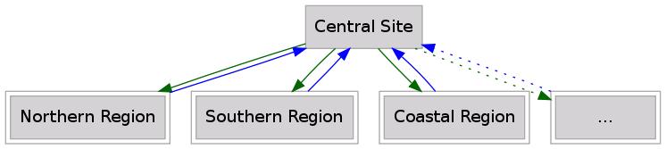
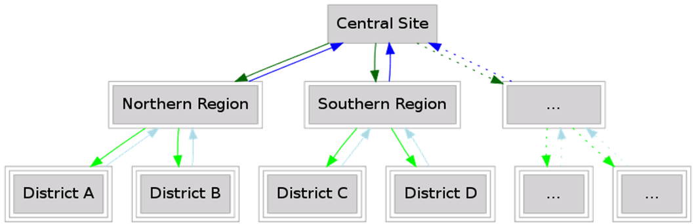
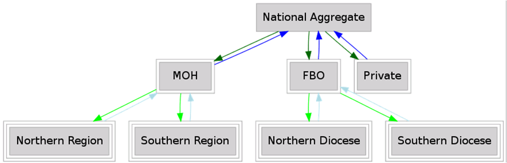
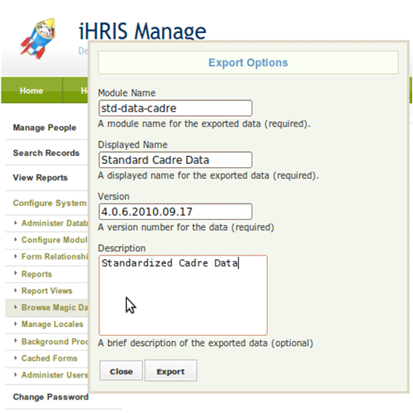

# Decentralized iHRIS

## 1. Decentralized iHRIS

This module outlines decentralization of iHRIS by running several iHRIS sites and aggregating data, including:

- reasons for decentralization
- prerequisites
- data model
- implementation details

## 2. Reasons for a Decentralized iHRIS

access: an office may not have a good Internet connection to the central server

data silos: different sites are used to keep data separate (for example, data from one district cannot be edited by another district)

customizations: there are different needs within a country—departments (education, health, etc.) or organizations (faith-based organizations and ministries of health) require different customizations of iHRIS

## 3. Standardized Data Prerequisite

Standardized Data Lists

- data sets that are shared across the sites (cadres, facility types, geography) must be standardized
- standardized lists should only be changed at the central level
- each list should be maintained as a separate module in magic data so updates can be easily distributed

## 4. Multitier Data Model

Example of a two-tier data model:

- national office (ministry of health)
- district health offices and hospitals

Example of a three-tier data model:

- national office (ministry of health)
- regional health offices
- district health offices and hospitals

## 5. Two-Tier Data Model

Central Site

- maintains standard list
- aggregates data from decentralized sites
- does not edit data from decentralized sites

Decentralized Site

- gets standard list from central site
- does not edit standardized lists
- passes local data only to central site
- data does not go to other decentralized sites

## 6. Three-Tier Geographic Example

## 7. Two/Three-Tier Organizational Example

## 8. Decentralized iHRIS Implementation

Specify each form in the form storage mechanism.

Specify if each form is read-write or read-only.

A form should only be read-write either at the central site or at the decentralized sites.

Standardized data should be in magic data:

- read-write at central site
- read-only at local sites

## 9. Standardized Data Example

&lt;?xml version="1.0"?&gt;
&lt;!DOCTYPE I2CEConfiguration SYSTEM "I2CE\_Configuration.dtd"&gt;
&lt;I2CEConfiguration name='SL-geography'&gt;
&lt;metadata&gt;
&lt;displayName&gt;Sierra Leone Geogrpahy&lt;/displayName&gt;
&lt;category&gt;Site&lt;/category&gt;
&lt;description&gt;
Sierra Leone base geographic configuration.
&lt;/description&gt;
&lt;version&gt;4.0.5&lt;/version&gt;
&lt;requirement name="Geography"&gt;
&lt;atLeast version="4.0" /&gt;
&lt;lessThan version='4.1'/&gt;
&lt;/requirement&gt;
&lt;priority&gt;375&lt;/priority&gt;
&lt;/metadata&gt;

&lt;configurationGroup path='/' name='SL-geography'&gt;
&lt;configurationGroup name='SL-region' path='/I2CE/formsData/forms/region'&gt;
&lt;configurationGroup name="SL\_national"&gt;
&lt;configuration name="last\_modified"&gt;
&lt;value&gt;2009-11-03 09:44:41&lt;/value&gt;
&lt;/configuration&gt;
&lt;configurationGroup name="fields"&gt;
&lt;configuration name="name"&gt;
&lt;value&gt;National&lt;/value&gt;
&lt;/configuration&gt;
&lt;configuration name="country"&gt;
&lt;value&gt;country|SL&lt;/value&gt;
&lt;/configuration&gt;
&lt;configuration name="code"&gt;
&lt;value&gt;Nat&lt;/value&gt;
&lt;/configuration&gt;
&lt;/configurationGroup&gt;
&lt;/configurationGroup&gt;
&lt;/configurationGroup&gt;

…..

## 10. Exporting Standardized Data

Export data for form "cadre":
"Configure System"
"Browse Magic Data Browser"
"I2CE"
"formsData"
"forms"
"cadre"

Click "Options".

Click "Export".

Choose "Save File To Site Customizations".

## 11. Decentralized iHRIS Implementation Example

For a form storage combination of:

- central site: multi-flat read-only
- decentralized site: entry read-write

Data is aggregated from decentralized sites to central site.

Form examples:

- person
- person\_position
- salary

ID examples:

- "person|5" used at decentralized sites. This is the id that is assigned by the system at one of the decentralized sites for a particular person's record. Multiple sites can use the same id, so the central system automatically addresses this when aggregating data (see next bullet).
- " person|5@EZ " and "person|5@WZ" used at the central site to import two different person records. The first is from the Eastern Zone, the second is from the Western Zone. These are the id's that are created by the central system when it aggregates the data from each of the decentralized sites to the central site. You'll see that it appends to the id from the decentralized site information on where that person's record came from -- the Eastern Zone and the Western Zone.

## 12. Decentralized iHRIS Implementation Example

For a form storage combination of:

- central site: magic data read-write
- decentralized site: magic data read-only

Standard lists are set at the central site.

Form examples:

- cadre
- geography

ID example:

- country|TZ used at both central and decentralized sites

## 13. Decentralized iHRIS Implementation Example

For a form storage combination of:

- central site: magic data read-only
- decentralized site: magic data read-write

All nonstandard translatable data is maintained at decentralized sites.

Data may be pushed down to subsites (district level).

Form examples:

- facility
- competency\_type

ID examples:

- "facility|15" used at decentralized sites
- "facility|15@EZ" and "facility|15@WZ" used at the central site
