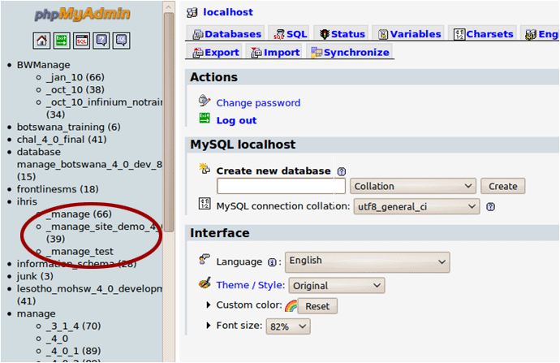
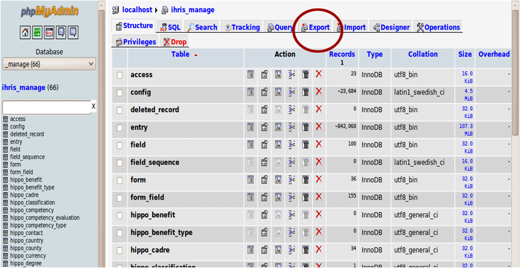
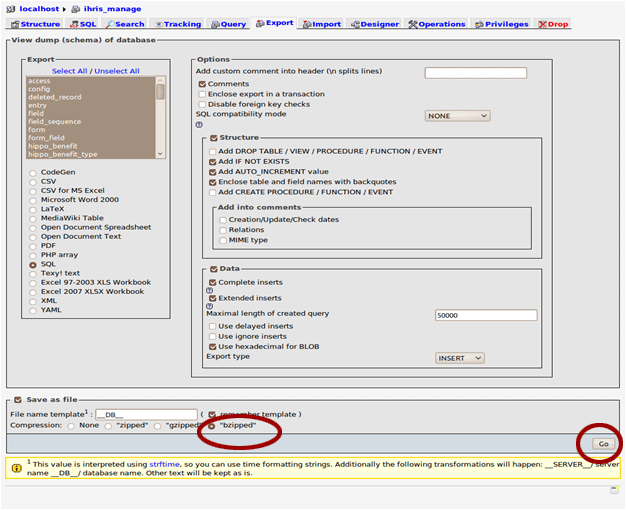

# Backing Up iHRIS

## 1. Backing up iHRIS

Backups should be a regular part of IT processes.

This should occur on a daily, weekly or monthly basis depending on the amount of iHRIS use.

Backups should also be performed before any system update.

All the source code for iHRIS is available; it is only essential to back up the database.

## 2. Database Backups

Backup example: for an installion of iHRIS Manage with a database named "ihris\_manage"

Back up this database in one of two ways:

- on the command line
- via the PHPMyAdmin Web interface to mysql

## 3. Command Line Database Backup

A database can be backed up easily from the command line by typing:
 **mysqldump ihris\_manage -u root -p &gt; ~/Desktop/ihris\_manage\_backup\_`date '+%d\_%m\_%Y'`.sql**

Note:
The ` symbol in the code above is the backtic, which is located to the left of the number 1 on a US keyboard.

## 4. Command Line Database Backup

There will now be a file "ihris\_manage\_backup\_01\_04\_2011.sql" on your desktop.

This file should be copied to a USB drive, an external hard drive, or another computer for safe keeping.

## 5. PHPMyAdmin

PHPMyAdmin is a web interface to the MySQL database.

Install it by running:
 **sudo apt-get install phpmyadmin**

Go to phpmyadmin at: http://localhost/phpmyadmin

The username is root and the password is the one you used to log in.

## 6. Backup by PHPMyAdmin

Once logged in, click the ihris\_manage link in the left hand navigation bar.

## 7. Backup by PHPMyAdmin

Click the "Export" tab.

## 8. Backup by PHPMyAdmin

Select "bzipped" compression and click Go. Pick bzipped because it has a higher compression rate.

