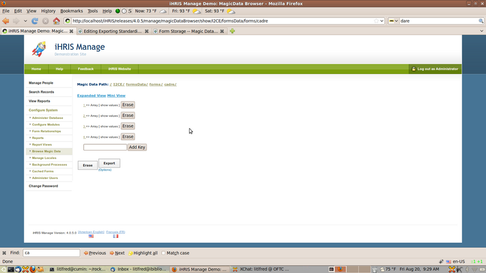
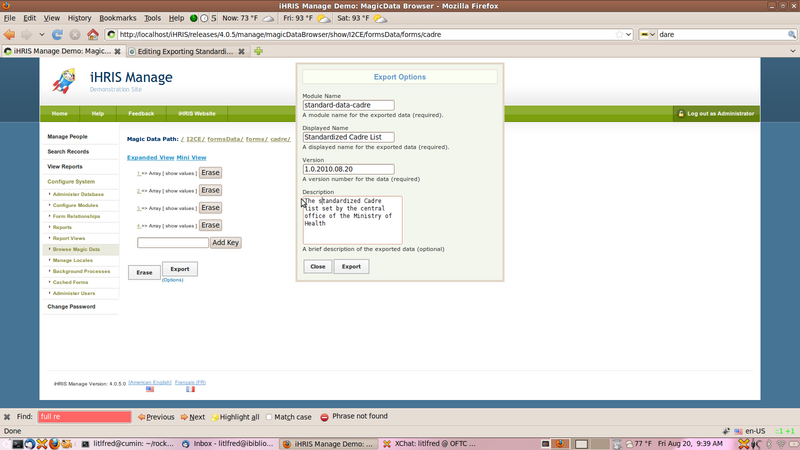

# Exporting Standardized Data

In this tutorial we show how to export standardized cadre data from a central site to be shared among regional and district installations.

Note: This module assume that the cadre form is stored in magic data. This is the default for iHRIS Manage version 4.0.

## Overview

We will create a module called standard-data-cadre that will contain all of the cadre's defined in the system. We will use the Magic Data Browser to automatically generate a configuration .xml file which we will save as standard-data-cadre.xml. Once we have created this module, we should make it available and required to each of the regional and district installations.

## First Steps -- Enabling the Magic Data Browser

We will export the cadre list using the "Magic Data Browser" module. If it is not available under the "Configure System" menu, then follow these steps to enable it:

- Browse to "Configure System"
- Click the "Configure Modules" link
- Click the link "Sub-Modules" to the right of the "Pages" module
- Check the check box next to "Magic Data Browser"
- Click the "Enable" button at the bottom of the page

## Creating the module

### Browsing in Magic Data

Creating the module is very easy. Go to:

- Browse to "Configure System"
- Click the "Browse Magic Data" link
- Click the "I2CE" link
- Click the "formsData" link
- Click the "forms" link
- Click the "cadre" link

You should now see a page that looks like:



Magic Data Browser

### Setting Export Options

Now that we have browser in magic data to /I2CE/formsData/forms/cadre we are ready to export the module:

- Click on the "(options)" link under the "Export" button
- Set the following data:

- Module Name: "standard-data-cadre"
- Displayed Named: "Standardized Cadre List"
- Version: Change it from "1.0.2010.09.17" to "4.0.2010.09.17"
- Description: "The Standardized Cadre list set by the central office of the Ministry of Health"

Your page should look like:



Export Options

Now click the "Export" button and your web-browser should ask you where to save the .xml file. We will save it as the file standard-data-cadre.xml. See the next section for some hints about where to save this file.

Note: The module in general should have version 4.0.YYYY.MM.DD where we replace YYYY with the year, MM with the numeric month and DD with the numeric day. For example the version would be 4.0.2010.08.17 if the data was exported on August 17, 2010. If we update the cadre list, at a later date (August 20, 2010), then we can re-export the list into the same module standard-data-cadre but this time with version 4.0.2010.08.20.

## Managing Decentralized iHRIS with Launchpad

First please see the article Decentralized iHRIS Data Policy for some background explanation.

Please also read Managing A Site In Launchpad for some background information on creating teams and working with bazaar on Launchpad.

Let us assume that we are working with a national site (National), and four regional sites (North,South,East and West) in the fictional country Taifeki

For example create a launchpad team, called ihris+taifeki, which you and all members of your development team will join. You should also create a project ihris-manage-taifeki with the code hosted on Launchpad.

### Code Layout

Here is a template for the directory layout for Taifeki's customizations which contains both the national and regional sites. Directories are indicated in blue.

- modules: the main modules directory which will contain all of the modules required by each of the sites.

- ihris-taifeki: a sub-directory of the modules folder which will contain the ihris-taikeki module

- ihris-taikeki.xml: Defines the module ihris-taifeki that will contain all of the requirements, html templates, etc. which are common to the national and regional sites. In particular, it will require the module standard-data-cadre. See below.
- standard-data-cadre: a sub-directory of the modules directory which will hold our standard cadre list module

- standard-data-cadre.xml: the module we exported from the magic data browser
- sites: A directory which will contain the four sites as well as the data management policy.

- data-policy-national.xml: Contains the data storage policy for the national site (see below)
- data-policy-regional.xml: Contains the data storage policy for each of the regional sites (see below)
- national: contains the national site.

- national-site.xml: The site configuration file for the southern site. Xincludes the data-policy-national.xml and requires the module ihris-tafeki. See below.
- north: contains the northern region site.

- northern-site.xml: The site configuration file for the northern site. Xincludes the data-policy-regional.xml and requires the module ihris-tafeki See below.
- south: contains the southern region site.

- southern-site.xml: The site configuration file for the southern site. Xincludes the data-policy-regional.xml and requires the module ihris-tafeki
- east: contains the eastern region site.

- eastern-site.xml: The site configuration file for the eastern site. Xincludes the data-policy-regional.xml and requires the module ihris-tafeki
- west: contains the western region site.

- western-site.xml: The site configuration file for the western site. Xincludes the data-policy-regional.xml and requires the module ihris-tafeki

## Sample .XML Configuration Files

### ihris-taifeki.xml

The is the module that contains all of the requirements, html templates, etc. which are common to the national and regional sites. In particular, it requires the module standard-data-cadre:

```
 <?xml version="1.0"?>
 <!DOCTYPE I2CEConfiguration SYSTEM "I2CE_Configuration.dtd">
 <I2CEConfiguration name='ihris-taifeki'>
   <metadata>
     <displayName>iHRIS Manage Taifeki</displayName>
     <category>Site</category>
     <description>the iHRIS Manage customizations for Taikeki that apply across
regional and central offices</description>
     <version>4.0.5</version>
     <requirement name='ihris-manage'>
       <atLeast version='4.0'/>
       <lessThan version='4.1'/>
     </requirement>
     <requirement name='standard-data-cadre'>
       <atLeast version='4.0'/>
       <lessThan version='4.1'/>
     </requirement>
     <!-- you should create a standard-data-XXXX module for each form XXXX that is being
     <path name='templates'>
       <value>./templates</value>
     </path>
     <path name='images'>
       <value>./images</value>
     </path>
     <priority>400</priority>
   </metadata>
 </I2CEConfiguration>
```

### national-site.xml

The is the site module for the nataional/central office site

```
 <?xml version="1.0"?>
 <!DOCTYPE I2CEConfiguration SYSTEM "I2CE_Configuration.dtd">
 <I2CEConfiguration name='taifeki-national-site'>
   <metadata>
     <displayName>iHRIS Manage Taifeki National</displayName>
     <category>Site</category>
     <description>the iHRIS Manage customizations for National Region of  Taikeki</descri
     <version>4.0.5</version>
     <requirement name='ihris-taifeki'>
       <atLeast version='4.0'/>
       <lessThan version='4.1'/>
     </requirement>
     <path name='modules'>
       <value>../../modules/value>
       <value>/var/lib/iHRIS/lib/4.0.5</value>
     </path>
     <path name='templates'>
       <value>./templates</value>
     </path>
     <path name='images'>
       <value>./images</value>
     </path>
     <priority>450</priority>
   </metadata>
  <configurationGroup name='taifeki-national-site' path='/'>
    <xi:include href="../data-policy-national.xml" xmlns:xi="http://www.w3.org/2001/XIncl
    <configurationGroup name='template' path='/I2CE/template'>
      <displayName>Template Information</displayName>
      <description>Various Default Information About The Templating System</description>
      <configuration name='prefix_title' values='single'>
        <displayName>Page title prefix</displayName>
        <value>iHRIS Manage Taifeki (Central Office)</value>
      </configuration>
    </configurationGroup>
    <configurationGroup name='custom_report_pdf_options' path='/modules/CustomReports/dis
      <displayName>PDF Options</displayName>
      <configurationGroup name='header'>
        <displayName>Header Options</displayName>
        <configuration name='text_prefix' >
          <displayName>Header Text</displayName>
          <value>iHRIS Manage Taifeki (Central Office)</value>
        </configuration>
      </configurationGroup>
    </configurationGroup>
  </configurationGroup>
 </I2CEConfiguration>
```

### northern-site.xml

The is the site module for the northern site

```
 <?xml version="1.0"?>
 <!DOCTYPE I2CEConfiguration SYSTEM "I2CE_Configuration.dtd">
 <I2CEConfiguration name='taifeki-northern-site'>
   <metadata>
     <displayName>iHRIS Manage Taifeki Northern</displayName>
     <category>Site</category>
     <description>the iHRIS Manage customizations for Northern Region of  Taikeki</descri
     <version>4.0.5</version>
     <requirement name='ihris-taifeki'>
       <atLeast version='4.0'/>
       <lessThan version='4.1'/>
     </requirement>
     <path name='modules'>
       <value>../../modules/value>
       <value>/var/lib/iHRIS/lib/4.0.5</value>
     </path>
     <path name='templates'>
       <value>./templates</value>
     </path>
     <path name='images'>
       <value>./images</value>
     </path>
     <priority>450</priority>
   </metadata>
  <configurationGroup name='taifeki-northern-site' path='/'>
    <xi:include href="../data-policy-regional.xml" xmlns:xi="http://www.w3.org/2001/XIncl
    <configurationGroup name='template' path='/I2CE/template'>
      <displayName>Template Information</displayName>
      <description>Various Default Information About The Templating System</description>
      <configuration name='prefix_title' values='single'>
        <displayName>Page title prefix</displayName>
        <value>iHRIS Manage Taifeki (Northern Region)</value>
      </configuration>
    </configurationGroup>
    <configurationGroup name='custom_report_pdf_options' path='/modules/CustomReports/dis
      <displayName>PDF Options</displayName>
      <configurationGroup name='header'>
        <displayName>Header Options</displayName>
        <configuration name='text_prefix' >
          <displayName>Header Text</displayName>
          <value>iHRIS Manage Taifeki (Northern Region)</value>
        </configuration>
      </configurationGroup>
    </configurationGroup>
  </configurationGroup>
 </I2CEConfiguration>
```

### data-policy-national.xml

In the data-policy-national.xml will be xincluded in our national site's configuration file. We want to set it so that the national site has the cadre list stored in magic data and is read-write.

We will also need to specify that we are aggregating data from each of the regional sites. This is done via the multi-flat form storage mechanism.

It should look like this:

```
  <configurationGroup name='form_storage' path='/modules/forms/forms'>
    <version>4.0.5.0</version>
    <configuration name='multi_flat_componentized'   path='/modules/forms/storage_options
         <value>1</value>
    </configuration>
    <configurationGroup name='multi_flat_components' path='/modules/forms/storage_options
         <configuration name='northern' values='many' type='delimited'>
              <value>database:manage_northern</value>
         </configuration>
         <configuration name='southern' values='many' type='delimited'>
              <value>database:manage_southern</value>
         </configuration>
         <configuration name='eastern' values='many' type='delimited'>
              <value>database:manage_eastern</value>
         </configuration>
         <configuration name='western' values='many' type='delimited'>
              <value>database:manage_western</value>
         </configuration>
    </configurationGroup>
    <configurationGroup name='cadre'>
        <configuration name='read_only' >
              <value>0</value>
        </configuration>
        <configuration name='storage'>
              <value>magicdata</value>
        </configuration>
    </configurationGroup>
    <!-- You need to repeat the read-write magic data storage for each of the forms we ar
    <configurationGroup name='person'>
        <configuration name='storage'>
              <value>multi_flat</value>
        </configuration>
    </configurationGroup>
    <!-- You need to repeat the multi_flat storage for each of the forms we are aggregati
  </configurationGroup>
```

### data-policy-regional.xml

In the data-policy-regional.xml will be xincluded in our regional site's configuration files. We want to set it so that the regional sites have the cadre list stored in magic data and is read-only. It should look like this:

```
  <configurationGroup name='form_storage' path='/modules/forms/forms'>
    <version>4.0.5.0</version>
    <configurationGroup name='cadre'>
        <configuration name='read_only' >
              <value>1</value>
        </configuration>
        <configuration name='storage'>
              <value>magicdata</value>
        </configuration>
    </configurationGroup>
    <!-- You need to repeat the read-only magic data storage for each of the forms we are
  </configurationGroup>
```
