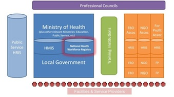

# Stage 0: Assess

*Understand What Is Needed*

It’s only natural to want to jump right into deploying a new human resource information system like iHRIS, once it’s decided that one is needed. Before beginning, though, take some time to assess the systems for managing health information that already exist.

iHRIS will be a sub-component of the health information system (HIS) or eHealth architecture that will need to share data with other information systems. During this stage, it’s important to identify all potential producers and users of HRH information. These will be sources of data for iHRIS. The assessment will also help you understand how HRH information will flow to other systems, as well as to users via reports.

Also look for gaps or needed resources to support iHRIS during the assessment phase. Some of the biggest challenges cited in implementing iHRIS are infrastructure needs, such as reliable electrical power, Internet connectivity, production and testing servers, and a place to store database backups. Training of everyone who will use iHRIS, both to enter data and analyze HR information, is also often overlooked. These needs must be factored into the total cost of the implementation.

Active participation of senior leadership is often cited as the most important factor in a successful implementation. At this stage, it is most valuable to identify “early adopters,” who can help build consensus by showing enthusiasm for the HRIS. With these stakeholders, begin to identify the policy and management questions that need to be answered by the HRIS.  For example, do you need a system to help determine the number of students graduating from nursing schools so you may predict your available health workforce?  Or do you need to know who is retiring in five years so you can determine if training should be scaled up?  This is also a good time to build your business case for iHRIS, which presents the problems to be solved and the benefits of using iHRIS to stakeholders.

## Objectives and deliverables

### Governance

Identify the primary champions, or stakeholders, of iHRIS.

- [Presentation: Building Stakeholder Leadership](https://toolkit.ihris.org/assess/presentation-building-stakeholder-leadership/) (presentation, hosted on the toolkit)

Determine whether there is an established regional body or health organization, such as a Health Workforce Observatory, that can provide technical assistance or additional resources.

- [CapacityPlus Technical Brief 2: West Africa’s Regional Approach to Strengthening Health Workforce Information (CapacityPlus, 2012)](http://www.capacityplus.org/technical-brief-2/) (external-link)
- [Global Health Workforce Alliance (WHO)](https://www.who.int/teams/health-workforce/network) (external-link)
- [Africa Health Workforce Observatory Network](https://aho.afro.who.int/hrh/af) (external-link)

### Project Management

Understand issues involved in planning an information systems project and developing a health information system.

- [Planning an Information Systems Project: A Toolkit for Public Health Managers (PATH, 2013)](http://www.path.org/publications/detail.php?i=2343) (external-link)
- [Developing Health Management Information Systems: A Practical Guide for Developing Countries (World Health Organization, Regional Office for the Western Pacific, 2004)](http://www.wpro.who.int/publications/pub_9290611650/en/) (external-link)

Present the problems to be solved and the benefits of using iHRIS to stakeholders. Get consensus from the leaders on the outcomes they expect from the implementation.

- [Presentation: Benefits of iHRIS](https://toolkit.ihris.org/assess/presentation-benefits-of-ihris/) (presentation, hosted on the toolkit)

### Software & Systems

Conduct an assessment survey of existing HRH information systems, processes, data collection forms, and standards. Assess existing infrastructure available to support the system and document any gaps.

- [WHO Country Assessment Tool on the Uses and Sources of HRH Data (World Health Organization, 2012)](https://www.who.int/publications/i/item/who-country-assessment-tool-on-the-uses-and-sources-for-human-resources-for-health-(hrh)-data) (external-link)
- [Worksheet: HRIS Assessment Questionnaire](https://toolkit.ihris.org/assess/worksheet-hris-assessment-questionnaire/) (document, hosted on the toolkit)

### Data Sharing & Interoperability

Conduct an assessment survey of existing HIS. Review the country’s eHealth strategy, if there is one, and document any policies that need to be followed.

- [Assessing the National Health Information System: An Assessment Tool (Health Metrics Network, WHO, 2008)](https://iris.who.int/items/96ce921c-730a-4bce-b924-e1f884eac457) (external-link)
- [Worksheet: HIS Assessment Survey](https://toolkit.ihris.org/assess/worksheet-his-assessment-survey/) (document, hosted on the toolkit)

### Data Quality & Standards

Understand the sources of HRH data and communicate the value of health workforce information.

- [Tipsheet: Sources of HRH Data](https://toolkit.ihris.org/assess/tipsheet-sources-of-hrh-data/) (document, hosted on the toolkit)

### Training & Support

Assess resources available to support trainings and document any gaps. Identify potential training sites.

- [Worksheet: Training Resources Assessment](https://toolkit.ihris.org/assess/worksheet-training-resources-assessment/) (spreadsheet, hosted on the toolkit)

### Data Use & Reporting

With stakeholders, begin defining the key HRH policy and management questions that need to be answered by the HRIS.

- [Presentation: Using HRH Information to Answer Key Policy and Management Questions](https://toolkit.ihris.org/assess/presentation-using-hrh-information-to-answer-key-policy-and-management-questions/) (presentation, hosted on the toolkit)
- [Data Demand and Information Use in the Health Sector: Conceptual Framework (MEASURE Evaluation, 2006)](https://www.measureevaluation.org/resources/publications/ms-06-16a.html) (external-link)
- [Human Resources Management Assessment Approach (CapacityPlus, 2013)](http://www.capacityplus.org/files/resources/hrm-assessment-approach.pdf) (external-link)

### Deliverable

Document the assessment results in a report for stakeholders. Based on the results, diagram the links between producers and users of HRH information to determine how data move through the systems and to whom it will be reported. Identify gaps in supporting ICT infrastructure.

- [Example: HRIS Assessment Report](https://toolkit.ihris.org/assess/example-hris-assessment-report/) (pdf, hosted on the toolkit)

**Key questions:**

- Is an HRIS appropriate for this environment?
- Is iHRIS the best software to fulfill the need?
- Do you have leadership support, infrastructure, and funding in place?

## Figure

This diagram depicts the many different producers and consumers of health workforce information.

## Challenges

There is often a tendency to commit too soon to project schedules and budgets, before the full scope of the project has been agreed upon. Some project areas may receive insufficient resources as a result. Be sure you understand all of the gaps and needs, and defer scheduling and budgeting until the Planning stage.

## Technical terms

- **human resources information system (HRIS)**: A human resources information system (HRIS) collects and manages information used in HR decision making. A complete HRIS links all HR data from the time professionals enter preservice training until they leave the workforce. Typically, the system is computerized and consists of a database for storing the information, software for entering and updating data, and reporting and analysis tools.
- **health information system (HIS)**: The health information system (HIS) includes all computerized systems for collecting, processing, and reporting health information to influence policy and decision making.
- **eHealth**: eHealth refers to the use of information and communications technologies (ICT) to support health. mHealth is a subset of eHealth, referring to the use of mobile devices, including phones, tablets, and PDAs, to support health.
- **infrastructure**: Information technology infrastructure includes all of the computer hardware, software, and networks required for the information system to operate, as well as supporting resources, such as physical space and reliable electricity.
- **early adopter**: An early adopter is someone who embraces or advocates for technology before it is widely accepted.
- **stakeholder**: A stakeholder is a person or organization with an interest or concern in the HRIS. All of the producers and consumers of health worker information, as well as those who make decisions based on that information, are stakeholders in iHRIS.
- **Policy and management questions**: Policy and management questions are questions about the health workforce that stakeholders need to answer. They inform health workforce policy and day-to-day HR management issues.
- **business case**: The business case describes the desired benefits of the system and the “why” of implementing it. It should compare these benefits to estimated costs.
- **Health Workforce Observatory**: A Health Workforce Observatory is a cooperative mechanism that brings together institutions aiming at HRH development and improvement based on evidence.
- **Interoperability**: Interoperability refers to the ability of two information systems to exchange data and interpret the shared data.
