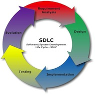

# Stage 1: Plan

*Ensure a Successful Implementation*

A planning phase is essential for defining the system requirements before installation of iHRIS begins. These requirements should build on the work done during the Assess stage.

Planning (as well as all subsequent stages) should be done in consultation with stakeholders. Understanding the various perspectives of the stakeholders and finding areas of consensus are important to ensure the success of the implementation. Representatives from the stakeholder organizations make up the Stakeholder Leadership Group (SLG). (An alternative established mechanism of stakeholder leadership might be an existing national Health Workforce Observatory or an HRH taskforce.) Forming the SLG requires high-level buy-in from HRIS champions (see Stage 0: Governance).

Together with the SLG, you will write the implementation plan, a detailed action plan for how iHRIS will be deployed. You will also collaboratively determine the requirements for customizing iHRIS so that it will produce the necessary data for informed decision making. The SLG should have final approval of these important deliverables.

## Objectives and deliverables

### Governance

Working with identified leaders, determine which representatives from stakeholder groups to invite to join the SLG. In the initial meeting, agree on Principles of Operation and Terms of Reference for the group.

- [Template: SLG Principles of Operation and Terms of Reference](https://toolkit.ihris.org/plan/template-slg-principles-of-operation-and-terms-of-reference/) (document, hosted on the toolkit)
- [Guidelines for Forming and Sustaining Human Resources for Health Stakeholder Leadership Groups (CapacityPlus, 2011)](https://www.capacityplus.org/guidelines-forming-and-sustaining-human-resources-health-stakeholder-leadership-groups.html) (external-link)

### Project Management

Develop roles and responsibilities for the members of the implementation team.

- [Template: Terms of Reference for iHRIS Project Team](https://toolkit.ihris.org/plan/template-terms-of-reference-for-ihris-project-team/) (document, hosted on the toolkit)

Establish tools for managing the project and working with the implementation team.

- [Example: GANTT Chart](https://toolkit.ihris.org/plan/example-gantt-chart/) (pdf, hosted on the toolkit)
- [Open source project management software, such as GanttProject](http://www.ganttproject.biz/) (external-link)

### Software & Systems

With the SLG and the implementation team, collaboratively develop the system requirements and document them using a standard methodology.

- [Template: User Requirements Specifications](https://toolkit.ihris.org/plan/template-user-requirements-specifications/) (document, hosted on the toolkit)
- [Collaborative Requirements Development Methodology (CRDM) Walk-through](http://phii.org/crdm/) (external-link)
- [Documentation: Use Case Development Tool and iHRIS Use Cases](https://toolkit.ihris.org/plan/documentation-use-case-development-tool-and-ihris-use-cases/) (document, hosted on the toolkit)

### Data Sharing & Interoperability

Identify standards to use when sharing data with other systems in the HIS.

- [Tipsheet: Standardized Data Lists](https://toolkit.ihris.org/plan/tipsheet-standardized-data-lists/) (document, hosted on the toolkit)
- [WHO’s ISCO-08 Classification of a health worker](https://www.who.int/publications/m/item/classifying-health-workers) (external-link)
- [Care Services Discovery Standard](http://wiki.ihe.net/index.php?title=Care_Services_Discovery) (external-link)

### Data Quality & Standards

Identify the sources of standard HRH data to be used in iHRIS. Determine whether the data are consistently formatted and coded across these sources. If not, decide with the SLG what the standards should be and document them with the system requirements.

- [Worksheet: Standard Datasets](https://toolkit.ihris.org/plan/worksheet-standard-datasets/) (spreadsheet, hosted on the toolkit)
- [Establishing and Using Data Standards in Health Workforce Information Systems (CapacityPlus, 2014)](http://www.capacityplus.org/files/resources/establishing-using-data-standards-health-workforce-information-systems.pdf) (external-link)

Review with the SLG data collection processes and forms. Revise forms to provide the minimum necessary dataset to answer policy and management questions.

- [Template: Sample Data Collection Forms](https://toolkit.ihris.org/plan/template-sample-data-collection-forms/) (document, hosted on the toolkit)

### Training & Support

Train data collectors to use revised data collection forms. Data collection can begin at any point after the data collectors are trained.

- [Job Aid: Fill Data Collection Form](https://toolkit.ihris.org/plan/job-aid-fill-data-collection-form/) (document, hosted on the toolkit)

### Data Use & Reporting

Document requirements for reports produced by iHRIS.

- [Template: Reporting Requirements](https://toolkit.ihris.org/plan/template-reporting-requirements/) (spreadsheet, hosted on the toolkit)

### Deliverable

Write the project implementation plan and attach the system and reporting requirements, as well as any data collection forms and supporting documentation. Share the plan with the SLG for their approval before proceeding with deployment.

- [Example and Template: Implementation Workplan](https://toolkit.ihris.org/plan/example-and-template-implementation-workplan/) (pdf, hosted on the toolkit)

**Key questions:**

- Have all stakeholders agreed on the implementation plan and system requirements?
- Are stakeholders engaged to provide input on policy and management questions?
- Are infrastructure, personnel, and financial resources available to support the deployment?

## Figure

Software development is a set of related activities that leads to the production of a software product. Software development includes five fundamental activities: 1) requirements analysis; 2) design; 3) implementation, or coding; 4) validation, or testing; 5) evolution, or maintenance and further development. Source

## Challenges

When determining the system requirements, it is important to assess the priority of each desired feature. A common challenge in software development projects is what’s known as “feature creep,” when the number of features expected of the system begin to creep outside the defined scope or document requirements for the software. Setting priorities and estimating development times will help determine which features are most important and which can be put off until a later iteration. As project manager, you will need to manage changing priorities and keep expectations realistic.

## Technical terms

- **Stakeholder Leadership Group (SLG)**: The Stakeholder Leadership Group (SLG)is a committee of representatives from all of the stakeholder organizations; the purpose of the group is to agree on the goals for iHRIS and oversee its implementation.
- **System requirements**: System requirements tell the software developers how to customize the software in order to fulfill the stakeholders’ needs for collecting, sharing, reporting, and ensuring quality of data.
- **Principles of operation**: Principles of operation define how the group will work together and the values that underlie the group’s operations.
- **Terms of reference**: Terms of reference describe the group’s purpose, vision, and goals, and they often assign roles and responsibilities to group members.
- **dataset**: A dataset is a collection of related sets of information composed of separate elements that can be manipulated as a unit.
