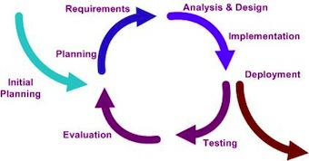

# Stage 2: Deploy

*Make iHRIS Work for You*

During the Deploy (or adaptation) phase, the implementation team installs iHRIS and customizes it to meet the system requirements. It is unlikely that iHRIS as installed will fulfill the requirements decided upon by the SLG. iHRIS has been designed to be easily customized by modifying fields, forms, and modules, or even programming new modules, if necessary.

While iHRIS is being installed, customized, and tested, consult the system requirements frequently. Often the unexpected occurs, and changes must be made to the requirements. It is important to document these changes by updating the requirements and noting what updates have been made.

The deliverable of this stage is production code, a version of iHRIS that fulfills the SLG’s requirements and is ready to use. The production code should be deployed on a dedicated server that has proper backups, uninterruptible power supply (UPS), and line conditioners installed. Do not edit any of the source code on the production server; instead pull in committed, tested code from the source code repository.

In addition to production code, you should maintain development code, a version of iHRIS that will continue to be customized as new needs emerge. The development code typically exists in two places: on the software developer’s computer or laptop, from which the developer commits changes to the source code repository; and on a testing server, where the committed code can be reviewed to ensure that the requested functionality is met.

Don’t neglect the SLG during this phase. Set a regular meeting schedule to establish roles and responsibilities and address issues that will arise. Since this group will oversee iHRIS throughout its operation—not only during the implementation phase, but well beyond—now is a good time to put in place standard operating procedures to ensure efficient operation of the SLG.

## Objectives and deliverables

### Governance

Document any standard operating procedures that exist or have been decided on by the SLG.

- [Example: Standard Operating Procedures for the Ministry of Health](https://toolkit.ihris.org/deploy-2/example-standard-operating-procedures-for-the-ministry-of-health/) (document, hosted on the toolkit)
- [Guideline for Forming and Sustaining Stakeholder Leadership Groups](https://www.capacityplus.org/guidelines-forming-and-sustaining-stakeholder-leadership-groups.html) (external-link)
- [Applying Stakeholder Leadership Group Guidelines in Ghana: A Case Study (CapacityPlus, 2013)](http://www.capacityplus.org/files/resources/applying-stakeholder-leadership-group-guidelines-in-ghana.pdf) (external-link)

### Project Management

Monitor whether customizations to iHRIS conform to the system requirements. Test the software with users or stakeholders to determine if the customizations meet expectations. If a change to the requirements is needed, log the change and the reason for it.

- [Worksheet: Issue Management List](https://toolkit.ihris.org/deploy-2/worksheet-issue-management-list/) (spreadsheet, hosted on the toolkit)

### Software & Systems

Download, install, set up, and customize the iHRIS software.

- [iHRIS Software](https://www.ihris.org/download/) (external-link)
- [iHRIS Global Support Community](https://www.ihris.org/community/) (external-link)
- [Documentation: iHRIS Implementation Tutorials](https://www.ihris.org/implementers/support-for-implementers/) (external-link)
- [Documentation: iHRIS Developers’ Guide](https://www.ihris.org/implementers/developers-guide/) (external-link)
- [Documentation: iHRIS Operations Guide](https://toolkit.ihris.org/deploy-2/documentation-ihris-operations-guide/) (document, hosted on the toolkit)

### Data Quality & Standards

Customize fields, forms, and modules in iHRIS according to the agreed-upon data standards.

- [Worksheet: Customization of Fields](https://toolkit.ihris.org/deploy-2/worksheet-list-of-data-fields-in-ihris-and-customization-of-fields/) (spreadsheet, hosted on the toolkit)

### Data Sharing & Interoperability

If existing data are available in electronic format, you may choose to import the data into iHRIS during this phase. Before importing, convert data to standardized data lists [ref to Tool1-D]. Otherwise, collect and enter initial data during the Pilot phase, after ensuring that data collection tools report according to the standardized data lists. See iHRIS Technical Documentation for instructions on how to import and store data in iHRIS.

### Data Use & Reporting

Customize reports based on the reporting requirements. Produce sample reports for testing. Engage with the SLG early on the report templates. See iHRIS Technical Documentation for instructions on how to customize reports.

### Training & Support

Develop and implement a program for training ICT staff on administering iHRIS. Plan for how ongoing support of iHRIS will be provided, including needed skills updates.

- [Presentation: iHRIS System Administration Training](https://toolkit.ihris.org/deploy-2/presentation-ihris-system-administration-training/) (presentation, hosted on the toolkit)
- [Open of Course free e-courses in Linux, programming, web design, and open source software development](http://www.open-of-course.org/courses/) (external-link)
- [Free Linux Training from the Linux Foundation](http://training.linuxfoundation.org/free-linux-training) (external-link)

### Deliverable

By the end of this phase, you should have two code branches of iHRIS: a production branch and a development branch. We recommend that you publish the code on Launchpad, the hosting site for all of the iHRIS code branches. See iHRIS documentation [above] for instructions on how to manage a site on Launchpad.

- [iHRIS Source Code on Launchpad](https://launchpad.net/ihris-suite/) (external-link)

**Key questions:**

- Does iHRIS meet the system requirements?
- Have all operability, customization, and systematic issues been identified and corrected?
- If there were changes to the requirements, have they been approved by the stakeholders?

## Figure

This model depicts an iterative software development process, in which the software is modified, deployed, tested, and evaluated in short cycles. Source

## Challenges

Without reading the documentation first, the developer or contractor installing iHRIS may assume it is just a simple database. If they don’t know iHRIS in detail, they may waste time or do some tasks incorrectly. For instance, they may not be able to import data stored in an Excel spreadsheet correctly because they don’t understand how iHRIS is structured. Developers should read through all of the technical documentation before proceeding with the installation.  More importantly, developers should join the iHRIS Google Group and explain what they are trying to do; there is a lot of help to be found from the iHRIS community.  Chances are someone has already done something similar to what the developer needs to do and can guide them along.

## Technical terms

- **field**: A field records a unit of data in the database.
- **form**: A form contains numerous fields, or spaces to enter data. Records are stored in iHRIS as forms.
- **module**: A module is software code that provides a set of related features for the system. Modules serve as the building blocks of iHRIS and are grouped according to the functionality they provide.
- **Production code**: Production code, also called deployment code,is a version of the software code in which all changes have been tested, no errors or bugs have been found, and the software is ready for use.
- **source code repository**: A source code repository is a place where source code is kept, either publicly or privately. The source code repository handles different versions of the software code and resolves conflicts arising from developers submitting modifications to the code.
- **Development code**: Development code is a version of the software to which changes are being made; this code will be merged into the production code branch once the changes have been tested and are ready for release.
- **Standard operating procedures**: Standard operating procedures document how business tasks should be performed.
