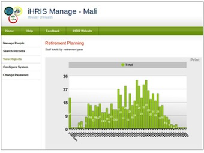

# Stage 3: Pilot

*Start Small and Show Value*

After installation, a pilot provides the opportunity to test iHRIS on a small scale in a real-world environment, such as in one facility, district, or region. The main objective of the pilot is to determine whether iHRIS, as currently deployed, meets the HRH information needs of the SLG and identify any changes that need to be made early in the process. It should also become clear whether the system requirements are adequate to support the goals that the stakeholders want to accomplish. The pilot results can be invaluable for demonstrating the capabilities of iHRIS to stakeholders.

Begin by ensuring that all hardware, software, and other infrastructure required to support iHRIS have been installed. These needs were identified during the Assess and Plan phases, but should be deployed before software installation can begin.

During the pilot, maintain close contact with the SLG to share results as they happen and come to quick decisions if changes are needed. All of this feedback contributes to the SLG’s understanding of how iHRIS will work when it is deployed on a wider basis. Consider forming a user group to supply immediate feedback on system improvements and usability. The chair of the user group should also participate in the SLG.

Needs for additional functionality and support will probably become apparent during the Pilot phase. Examples include the need for data entrants to enter the backlog of health worker data into iHRIS in a timely manner or a server to back up iHRIS data. Consider adopting an iterative development approach to customizing iHRIS to keep up with emerging needs. This approach allows you to incorporate new requirements as you go. Ensure transparency of these needs with the SLG.

## Objectives and deliverables

### Governance

Meet with the SLG to share the pilot plan and decide how results will be communicated.

- [Presentation: Pilot Activities and Results](https://toolkit.ihris.org/pilot/presentation-pilot-activities-and-results/) (presentation, hosted on the toolkit)

### Project Management

As the pilot progresses, document any issues that arise. Consult the SLG on any major changes that need to be made.

- [Example: Project Risks Status Update](https://toolkit.ihris.org/pilot/example-project-risks-status-update/) (pdf, hosted on the toolkit)

### Software & Systems

Discuss with the software developers new requirements that emerge during the pilot. Decide which new features to develop using an iterative approach.

- [Tipsheet: Iterative Software Development](https://toolkit.ihris.org/pilot/tipsheet-iterative-software-development/) (document, hosted on the toolkit)

### Data Sharing & Interoperability

Determine whether to establish a link with another information system and share data as part of the pilot project. With the SLG, create a data-sharing agreement to set policies for how data will be shared, used, and protected.

- [Presentation: Creating a Data-Sharing Agreement](https://toolkit.ihris.org/pilot/presentation-creating-a-data-sharing-agreement/) (presentation, hosted on the toolkit)

### Training & Support

Train data entrants, iHRIS users, and HR managers participating in the pilot on how to use iHRIS. Collect and enter data for the pilot area.

- [iHRIS Training Program Materials and User’s Manuals](https://toolkit.ihris.org/pilot/ihris-training-program-materials-and-users-manuals/) (document, hosted on the toolkit)

### Data Quality & Standards

Institute procedures to reduce data entry errors.

- [Example: HRIS Data Quality Guidelines](https://toolkit.ihris.org/pilot/example-hris-data-quality-guidelines/) (pdf, hosted on the toolkit)

### Data Use & Reporting

Run pilot reports and present them to the SLG. Based on feedback, make any additional customizations to the reports. Share the successful results of the pilot with the SLG and other interested parties. Encourage the stakeholders to promote iHRIS.

- [Example: Pilot Report](https://toolkit.ihris.org/pilot/example-pilot-report/) (pdf, hosted on the toolkit)

### Deliverable

Prepare a final report of the pilot findings for presentation to the SLG. Assess the results of the pilot.

- [Example: Pilot Findings Report and Assessment Checklist](https://toolkit.ihris.org/pilot/example-pilot-findings-report-and-assessment-checklist/) (document, hosted on the toolkit)

**Key questions:**

- Did the pilot demonstrate sufficient value of iHRIS to support scaling up the system?

## Figure

Pilot reports using actual data from iHRIS are powerful tools for demonstrating the benefits of iHRIS to stakeholders and high-level decision makers. This report from Mali projects the number of retiring workers, which supports recruitment planning.

## Challenges

Pilot tests take time and involve careful planning. Challenges you may not have been able to foresee will arise. These issues may point to resources, such as training or infrastructure, that are inadequate to support the iHRIS implementation. Document these challenges and how you worked to overcome them so that the same problems won’t recur during the scale-up phase. If the pilot is not documented and evaluated well enough, you may not be able to demonstrate the value required to scale up.

## Technical terms

- **pilot**: A pilot is a trial deployment of software on a small scale intended to test the software’s functionality in a real-world situation.
- **user group**: A user group is an organization of users of a specific software program. Members share experiences and ideas to improve their understanding of the software and to influence its development.
- **Usability**: Usability refers to the ease of use of a software program or information system, as well as to how easy it is to learn to use the system.
- **Iterative development**: Iterative development means working on small sets of tasks or new features at a time and frequently turning out new iterations, or versions of the software, that users can react to.
