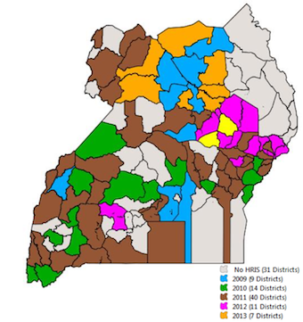

# Stage 4: Scale-up

*Extend Your Pilot to All Stakeholders*

The decision to scale up iHRIS to its planned reach—to all districts in the country, for example—should not be taken for granted. It depends on the successful conclusion of the pilot demonstration. A successful pilot often creates momentum and enthusiasm for adopting iHRIS more widely, including adding additional components of the iHRIS Suite.

Scaling up has its own set of challenges. Human resources and infrastructure may be limited in some areas, or there may not be adequate funding to support the deployment. Instead of scaling up all at once, a phased rollout may be the best plan.

Buy-in is important so that the regions don’t see iHRIS implementation as a central project that doesn’t involve them. In a large scale-up, users at all levels must be aware of the benefits the software can provide them to ensure data reliability. For example, the data can be used for decision making at the facility level, not just for country-wide planning. Those employees responsible for maintaining the data will be more accurate when they can realize the direct benefits.

What kind of scale-up will you be doing? This depends on the available infrastructure in the areas where iHRIS will be rolled out. For example, will there be a central server that everyone has restricted access to or will there be several servers? Both options have their own set of issues to plan for and resolve. The central server may need to be improved, or you may need to provide additional ICT training in the scale-up locations.

The installation of a new system in any organization will require changes in policy and procedure. These changes must be managed for each organization in the scale-up region to ensure that the system is used effectively. Document changes to policies, procedures, and employee responsibilities that will be required in each area to accommodate the new system. Make sure these are communicated and implemented into everyday tasks.

Training efforts must be scaled up as well. Plan for training of trainers to ensure that the iHRIS implementations can be sustained over time. Educating senior executives in the effective use and interpretation of data is essential to ensure that iHRIS improves workforce planning.

This may also be a good time to promote sharing of data among different organizations. For the data to be used, it must be considered reliable and trustworthy, so procedures for ensuring data quality need to be in place. When rolling out iHRIS to multiple districts or facilities, it is important to give a single agency overall responsibility for ensuring data quality, access, and reporting. Ideally, this is the same body that is responsible for health workforce planning and policy. This body should ensure that data standards are enforced across the rollout region.

## Objectives and deliverables

### Governance

Institute routine reporting of scale-up progress to the SLG.

- [Example: HRIS Progress Report](https://toolkit.ihris.org/scale-up/example-hris-progress-report/) (document, hosted on the toolkit)

### Project Management

Prepare a phased rollout plan for scaling up iHRIS. Include projected costs and funding, as well as infrastructure, human resource needs (including roles and responsibilities), technical support, and training plans.

- [Example: Rollout Plan](https://toolkit.ihris.org/scale-up/example-rollout-plan/) (document, hosted on the toolkit)

### Software & Systems

Assess available ICT infrastructure and support in the districts and/or facilities where iHRIS will be deployed.

- [Worksheet: eHealth Readiness Assessment Checklist](https://toolkit.ihris.org/scale-up/worksheet-ehealth-readiness-assessment-checklist/) (document, hosted on the toolkit)

### Data Sharing & Interoperability

Determine whether any HIS in the rollout regions can benefit from sharing data with iHRIS. If so, establish a method and agreements for sharing data.

- [OpenHIE Provider Registry: Interconnecting Human Resource Information Systems](https://toolkit.ihris.org/scale-up/openhie-provider-registry-interconnecting-human-resource-information-systems/) (document, hosted on the toolkit)

### Data Quality & Standards

Work with the organization responsible for oversight of data to create a plan for ensuring data quality.

- [Data Quality Considerations in Human Resources Information Systems (HRIS) Strengthening (CapacityPlus, 2008)](http://www.capacityplus.org/files/resources/projectTechBrief_10.pdf) (external-link)

### Training & Support

Prepare a training plan for each area where iHRIS is implemented. Include a plan for training of trainers who can orient new employees or users to iHRIS.

- [Training of Trainers’ Guide](https://toolkit.ihris.org/scale-up/training-of-trainers-guide/) (document, hosted on the toolkit)

Implement a training program in data use for senior executives and other data users.

- [Case Study: Human Resources Management Training](https://toolkit.ihris.org/scale-up/case-study-human-resources-management-training/) (document, hosted on the toolkit)

### Data Use & Reporting

Assess routine reporting needs. Document standard operating procedures for reporting.

- [Example: Human Resources Quarterly Management Review](https://toolkit.ihris.org/scale-up/example-human-resources-quarterly-management-review/) (presentation, hosted on the toolkit)
- [Improving Data Use in Decision Making: An Intervention to Strengthen Health Systems (MEASURE Evaluation, 2012)](https://www.measureevaluation.org/resources/publications/sr-12-73.html) (external-link)

### Deliverable

The deliverable for this phase is the successful rollout of iHRIS in each location where it is to be deployed. Since this is a phased rollout, implementation of iHRIS will likely now be in different phases in different locations. Some locations will have moved on to the Sustain phase, while others may be just starting to deploy iHRIS.

**Key questions:**

- Has iHRIS been deployed in all appropriate locations?
- Are data being shared routinely between rollout locations and the central location?

## Figure

Map showing the geographical rollout of iHRIS in Uganda according to year of establishment. Credit: Uganda Capacity Program.

## Challenges

Success for the rollout of iHRIS and wide adoption of the system requires involving key stakeholders, such as the Ministry of Health, in every activity of the rollout. Engage the SLG early on in the rollout process and keep them informed throughout.

## Technical terms

- **Phased rollout**: Phased rollout is the process of deploying a computer system to multiple offices or facilities in an incremental way. Because it isn’t rolled out at once, the organization doesn’t have to deal with potential issues at the same time. Furthermore, information learned from early stages can be applied to the rest of the process, so there are fewer issues as the implementation continues. A phased rollout also allows users to adjust to the new system gradually.
