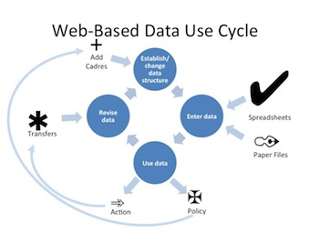

# Stage 5: Sustain

*Maintain and Support the System*

iHRIS requires ongoing support and improvement to ensure sustainability. Further development of iHRIS should be driven by its usefulness to stakeholders and data users. Regular monitoring and evaluation determines what iHRIS is accomplishing, what needs to be improved, and whether results are being achieved. HRIS performance measures are benchmarks for evaluating how efficient and effective the system is. Regular use of the system for decision-making, with most stakeholders accepting its data as reliable and valid, would be the ultimate measure of the system’s performance.

The goal of any performance monitoring plan (PMP) is not to focus on what is wrong and condemn it; rather, it is to highlight the positive aspects of the system that make it work, as well as to identify what went wrong as a basis for improvement. Ideally, a working group—often a subcommittee of the SLG—is responsible for implementing the PMP. Monitoring efforts should become a regular activity.

To encourage data demand and use for management of health workers, iHRIS needs to support everyday business processes, including new processes that may be developed. The stakeholders, via the SLG or another oversight mechanism, should continue to provide feedback about changing needs. System maintenance involves meeting these additional requirements, making iHRIS easier to use and more efficient over time, and incorporating new technologies as necessary.

It is important to communicate to stakeholders and the general public how iHRIS data have been used to address HRH policy and management challenges. This feedback links iHRIS with improving health outcomes. The SLG may consider making some reports publicly available, perhaps through a website or mobile application.

Be sure to document and store information on the evolution and growth of iHRIS, such as changes to the system and reasons for those updates. As new users enter the arena, a historical reference can be useful. Also document any challenges and how they were overcome. Sharing challenges and successes with the global iHRIS community helps everyone learn and contributes to the iHRIS development project as a whole.

## Objectives and deliverables

### Governance

Plan for regular customizations of iHRIS to support emerging business processes

- [Worksheet: Business Processes Documentation](https://toolkit.ihris.org/sustain/worksheet-business-processes-documentation/) (document, hosted on the toolkit)
- [Analyze Business Processes Before Automating Them: An iHRIS Case Study (Marino Holguin, Guatemala, 2013)](https://www.ihris.org/2013/05/analyze-business-processes-before-automating-them-an-ihris-manage-case-study/) (external-link)

### Project Management

Develop a plan for systematic monitoring and evaluation of iHRIS using predefined indicators.

- [Application of PRISM Tools and Interventions for Strengthening Routine Health Information System Performance (MEASURE Evaluation, 2013)](https://www.measureevaluation.org/resources/publications/wp-13-138.html?searchterm=PRISM+invent) (external-link)

### Software & Systems

Create a maintenance plan for supporting iHRIS. Follow up with users to determine how iHRIS is performing.

- [Template: HRIS Follow-Up Report](https://toolkit.ihris.org/sustain/template-hris-follow-up-report/) (document, hosted on the toolkit)

Determine whether new customizations or extensions of iHRIS are required to meet users’ needs. Document the requirements and develop them iteratively.

- [Documentation: iHRIS Train System Requirements](https://toolkit.ihris.org/sustain/documentation-ihris-train-system-requirements/) (document, hosted on the toolkit)

### Data Sharing & Interoperability

Consider sharing data from iHRIS regionally or internationally.

- [OpenHIE Health Worker Registry](http://ohie.org/) (external-link)
- [IT Infrastructure Technical Framework Supplement Care Services Discovery (CSD) Trial Implementation (IHE International, 2013)](http://ihe.net/uploadedFiles/Documents/ITI/IHE_ITI_Suppl_CSD.pdf) (external-link)
- [African Atlas of the Health Workforce](https://aho.afro.who.int/hrh-data/af) (external-link)

### Data Quality & Standards

Develop a routine schedule and procedure for collecting and updating human resources data.

- [Example: Employee Record Update Protocol](https://toolkit.ihris.org/sustain/example-employee-record-update-protocol/) (document, hosted on the toolkit)

Institute a regular data audit to validate the accuracy of HRH data.

- [Worksheet: Data Quality Assessment Form](https://toolkit.ihris.org/sustain/worksheet-data-quality-assessment-form/) (document, hosted on the toolkit)

### Training & Support

Plan for how to provide technical support for iHRIS over the long term. Establish a helpdesk and user documentation such as Frequently Asked Questions.

- [Worksheet: Helpdesk Log](https://toolkit.ihris.org/sustain/worksheet-helpdesk-log/) (spreadsheet, hosted on the toolkit)
- [iHRIS Frequently Asked Questions (FAQ)](https://www.ihris.org/ihris-suite/faq/) (external-link)
- [Free Helpdesk (open source helpdesk software)](http://freehelpdesk.org/) (external-link)

Plan for continuing ICT skills development.

- [Report: Internship Program](https://toolkit.ihris.org/sustain/report-internship-program/) (pdf, hosted on the toolkit)

### Data Use & Reporting

Establish routine evaluation of how data from iHRIS is used.

- [Checklist: Monitoring the Use of Data](https://toolkit.ihris.org/sustain/checklist-monitoring-the-use-of-data/) (document, hosted on the toolkit)
- [Tools for Data Demand and Use in the Health Sector: Framework for Linking Data with Action (MEASURE Evaluation, 2011)](https://www.measureevaluation.org/resources/publications/ms-11-46.html) (external-link)
- [Building the Bridge from Human Resources Data to Effective Decisions: Ten Pillars of Successful Data-Driven Decision Making (CapacityPlus, 2008)](http://www.capacityplus.org/files/resources/projectTechBrief_11.pdf) (external-link)

Discuss with stakeholders the value of making reports from iHRIS publicly available. Consider methods for publicly distributing this information that are appropriate for the context. Share success stories from iHRIS such as money saved.

- [Bringing Health Workforce Information to the Public in Uganda (CapacityPlus)](https://www.capacityplus.org/Bringing-Health-Workforce-Info-to-the-Public-in-Uganda.html) (external-link)

### Ongoing

Open source projects like iHRIS depend on contributions from its users to expand features and fix issues. Sustaining iHRIS includes joining the Global Support Community on www.ihris.org and sharing your improvements to iHRIS so everyone can benefit from them. You can contribute code changes, new modules that you’ve developed, or even an entirely new application to solve a health workforce information issue. It is also valuable to share documentation and tools you’ve found useful like the ones in this Toolkit. Even making a simple bug report or sharing a helpful tip can improve iHRIS for everyone.

## Figure

Data entered into iHRIS becomes available for use, but the data changes in both its use and character over time. The data will need to be revised and even the structure changed to address changes. These changes restart the process of entry and use. Source: Adapted from a presentation by Shalina Verma and Manju Shukla (IntraHealth India)

## Challenges

Sustainability of iHRIS depends on ongoing support and buy-in from the government or implementing organization. iHRIS must be seen as valuable, and resources must be budgeted to maintain it.

## Technical terms

- **Monitoring and evaluation**: Monitoring and evaluation refers to processes of monitoring a program and evaluating the impact it has in order to assess the success of and gaps in program implementation.
- **business process**: A business process is a set of tasks to accomplish a specific organizational goal. Examples of business processes include processes that govern the operation of iHRIS and operational processes such as recruitment, accounting, and employee professional development. The process can usually be visualized as a flowchart.
- **indicator**: An indicator is a measure that is used to demonstrate progress in or results of an activity.
- **data audit**: A data audit refers to the auditing of data to assess quality or utility. Auditing data involves looking at key metrics to come to conclusions about the properties of a dataset.
- **helpdesk**: A helpdesk is a service within an organization providing information and support to computer users.
- **Frequently Asked Questions**: Frequently Asked Questions, or a FAQ, is a list of questions and their answers pertaining to a particular piece of software or another topic, which are commonly asked.
